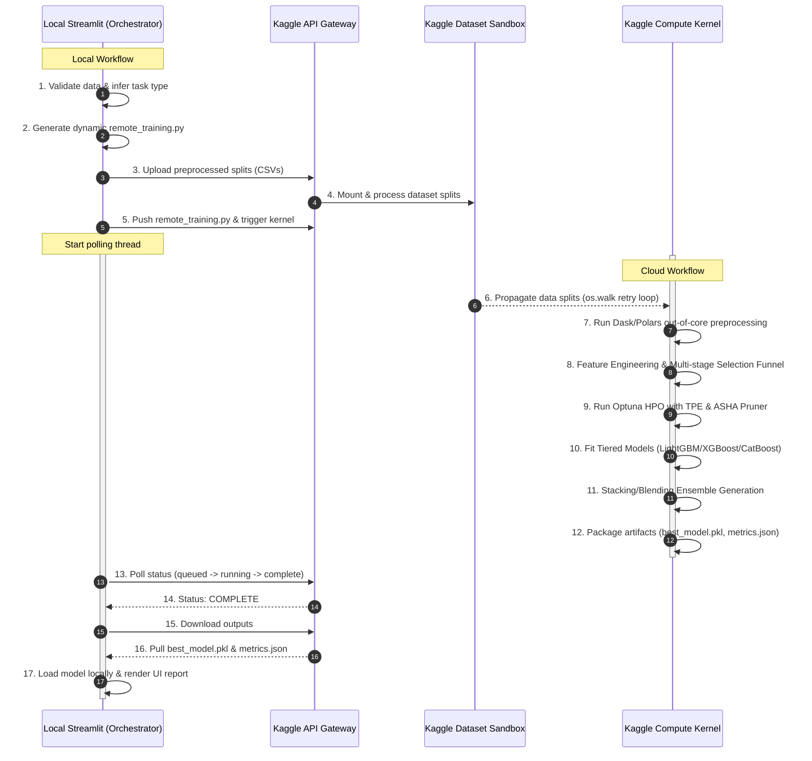

# Execution Boundary & Workflow Plan: Enterprise AutoML Pipeline

This document defines the strict architectural boundaries, workflow handoffs, and resource management strategies between the **Local Environment (Streamlit Orchestrator)** and the **Cloud Environment (Kaggle Compute Engine)**. It replaces the basic placeholder script with an enterprise-grade AutoML pipeline designed for memory safety, scalability, and automated optimization.

---

## 1. System Architecture Overview

The following diagram illustrates the unidirectional data flow and boundary separation between the local orchestrator and the cloud execution sandbox:



---

## 2. Local Workflow (Streamlit Orchestrator)

The local machine serves purely as an **orchestrator and interface**. No heavy training computations or high-memory data transformations are executed locally.

| Step | Action | Description | Code/Module |
|---|---|---|---|
| **L1** | **UI Configuration & Target Definition** | User uploads dataset, selects the target column, and specifies the time/computational budget. | `app.py` |
| **L2** | **Lightweight Validation** | Verifies basic data integrity (e.g., checks that the target column has no missing values, ensures classification targets have $\ge 2$ classes, verifies file size is within bounds). | `core/preprocessor.py` |
| **L3** | **Task Inference** | Infers ML task type (Binary Classification, Multiclass Classification, or Regression) based on target cardinality and data type. | `core/analyzer.py` |
| **L4** | **Data Splitting** | Splits data into train and test sets (`X_train`, `y_train`, `X_test`, `y_test`) to ensure validation metrics can be computed locally upon model return. | `app.py` |
| **L5** | **Dynamic Script Generation** | Generates a custom `remote_training.py` containing parameters matched to the user's specific dataset shape, task type, and model selection. | `core/kaggle_client.py` |
| **L6** | **API Handshake & Push** | Calls Kaggle API to upload the dataset splits (as a private dataset) and pushes the generated training code and `kernel-metadata.json`. | `core/kaggle_client.py` |
| **L7** | **Non-blocking Polling Thread** | Launches a background thread to poll the run status (respecting rate limits with backoff) while keeping the Streamlit Chat UI responsive. | `app.py` |

---

## 3. Cloud Workflow (Kaggle Compute Engine)

All resource-heavy operations are offloaded to the Kaggle sandbox environment, taking advantage of remote CPU/GPU allocations and up to 30GB of RAM.

```
Kaggle Input Directory
 └── dataset-automl-[run_id]/
      ├── X_train.csv
      ├── y_train.csv
      ├── X_test.csv
      └── y_test.csv
```

### Step-by-Step Cloud Execution Pipeline:

1. **Mount Propagation Defense Loop**:
   Before initiating execution, the script runs a retry-loop checking `/kaggle/input/` recursively for `X_train.csv`. This prevents immediate crashes due to GCS-to-container mount synchronization delays.
2. **Polars Out-of-Core Processing**:
   Loads datasets as lazy structures. Numerical columns are aggressively downcasted (e.g., `Float64` $\rightarrow$ `Float32`, `Int64` $\rightarrow$ `Int32`). Categorical columns with low cardinality are cast to `Categorical` type to minimize RAM footprint.
3. **Missing Value Imputation Cascade**:
   - $\le 5\%$ missingness: Imputed using median/mode.
   - $5\% - 30\%$ missingness: Imputed using `IterativeImputer` (Bayesian Ridge).
   - $>30\%$ missingness: Drops the column or generates a binary missing indicator based on threshold rules.
4. **Feature Engineering & Selection Funnel**:
   - Generates interaction features only between the top-10 features by mutual information to prevent dimensionality explosion.
   - **Selection stages**: Variance Threshold ($0.01$) $\rightarrow$ Pearson Correlation pruning ($|r| > 0.95$) $\rightarrow$ Mutual Information top 80th percentile $\rightarrow$ Recursive Feature Elimination (RFE) using a lightweight LightGBM estimator.
5. **Optuna HPO & Multi-Fidelity Pruning**:
   - Optimizes hyperparameters using Tree-structured Parzen Estimators (TPE).
   - Applies Asynchronous Successive Halving (ASHA) via a `MedianPruner` to terminate poor trials after 20 boosting iterations.
6. **Tiered Model Selection & Training**:
   - **Classification**: LightGBM Classifier, XGBoost Classifier, and CatBoost Classifier.
   - **Regression**: LightGBM Regressor, XGBoost Regressor, and CatBoost Regressor.
7. **Diversity-Checked Ensemble Generation**:
   - Predictions from the top-3 models are checked for correlation. If correlation is $< 0.97$ (ensuring prediction diversity), they are stacked using a Ridge/Logistic Regression meta-learner. Otherwise, a weighted average (Blending) is used.
8. **Artifact Packaging**:
   - Serializes the final trained model pipeline as `best_model.pkl`.
   - Compiles validation metrics, cross-validation metrics, feature importances, and learning curves into `metrics.json`.

---

## 4. The Bridge (Handoff & Artifacts)

The interface boundary defines exactly what payloads cross between the environments:

### Outbound Payload (Local $\rightarrow$ Kaggle Cloud)
- **Data Splits**: Four CSV files (`X_train.csv`, `y_train.csv`, `X_test.csv`, `y_test.csv`) to isolate training and validation data.
- **`dataset-metadata.json`**: Kaggle dataset metadata mapping user ownership and dataset privacy settings.
- **`remote_training.py`**: The dynamically constructed training code containing the target column, task type, and HPO budget.
- **`kernel-metadata.json`**: Configures the execution engine (private kernel, GPU enablement, internet access).

### Inbound Payload (Kaggle Cloud $\rightarrow$ Local)
- **`best_model.pkl`**: The fully fitted ensemble/individual model ready for inference.
- **`metrics.json`**: High-fidelity metadata containing model performance metrics, training configuration, and plotting coordinates.
- **`__results__.html`**: Automatic Kaggle notebook execution log representing stdout/stderr and script cell outputs.

### Payload Schema Matrix

| Artifact | Direction | Format | Size Range | Critical Content |
|---|---|---|---|---|
| **Data Splits** | Local $\rightarrow$ Cloud | CSV (Zipped/Text) | 100 KB - 500 MB | Serialized feature matrices and targets |
| **`remote_training.py`** | Local $\rightarrow$ Cloud | Python Script | 4 KB - 10 KB | Execution instructions, HPO parameters |
| **`best_model.pkl`** | Cloud $\rightarrow$ Local | Pickle Binary | 1 MB - 50 MB | Serialized estimator pipeline (LightGBM/XGBoost) |
| **`metrics.json`** | Cloud $\rightarrow$ Local | JSON Text | 5 KB - 20 KB | Validation metrics, SHAP scores, CV statistics |

---

## 5. Model Training Execution & Constraints

To run reliably within the Kaggle container constraints without incurring Out-Of-Memory (OOM) faults or script timeouts, the execution engine enforces strict resource limits:

### 5.1 Memory Guard & Safety Limits
- **watermark monitoring**: A background thread checks memory utilization every 2 seconds. If utilization crosses **85%**, the current trial is aborted, garbage collection (`gc.collect(generation=2)`) is triggered, and subsequent chunk sizes are halved.
- **Type Downcasting**: Numeric variables are downcasted aggressively immediately after loading. Categorical variables are target-encoded or one-hot encoded in a sparse matrix structure to reduce memory overhead by up to **90%**.
- **Cyclic GC Control**: Python's cyclic garbage collector is disabled during training iterations and run explicitly between trials to avoid overhead latency.

### 5.2 CPU/GPU Allocation
- **CPU Partitioning**: The number of parallel Joblib workers is bound to `physical_cores - 1` (defaulting to 3 on 4-core containers) to prevent lockups and context-switching overhead.
- **GPU Scaling**: If GPU acceleration is enabled in `kernel-metadata.json` (e.g., T4 GPU), XGBoost automatically executes with `device='cuda'` and LightGBM with `device='gpu'`. If GPU memory exceeds **90%**, batch sizes are halved dynamically.

### 5.3 Time Budget & Early Stopping
- **Watchdog Timeout**: A global callback halts HPO when $90\%$ of the user's allocated time budget is reached, immediately pushing the best-known model to the assembly stage.
- **Early Stopping**: All gradient boosting algorithms use `early_stopping_rounds=50` against the validation fold, ending training early if metrics stagnate.
- **ASHA Trial Pruning**: Optuna's `MedianPruner` terminates trials whose score falls below the median of previous runs at the same epoch, cutting training time by up to **70%**.
