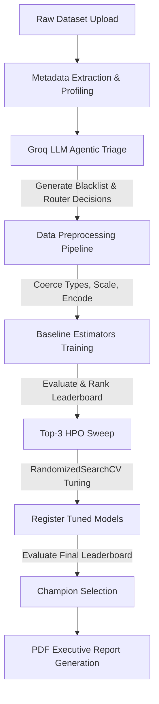

# Technical Project Documentation: SOL AutoML Core Module
**Lead Architect**: SOL (Lead AI Engineer & MLOps Architect)  
**Platform**: Al-Dalil Enterprise AutoML Platform  
**Release Version**: v2.0-Stable  

---

## 1. Executive Vision & Architecture Overview

### The Core Philosophy
Traditional AutoML platforms operate under a resource-intensive "brute-force" paradigm. They run exhaustive grids of unregularized estimators on uncleaned, unprofiled raw data, leading to severe model overfitting, memory consumption spikes, and compute resource waste. 

The **SOL AutoML Core Module** shifts this paradigm by implementing an **Agentic, Data-Centric, and Model-Regularized Framework**. By placing an intelligent, LLM-powered selection and profiling layer before training, and combining it with strict baseline model regularization, the platform ensures generalization stability and optimal resource utilization.



### Core Workflow Lifecycle
1. **File Ingestion**: Supports `.csv`, `.xlsx`, and `.json` formats. Performs initial column name sanitization to prevent special character issues in downstream libraries (such as LightGBM).
2. **Metadata Profiling**: Extracts basic data fingerprint signatures (null percentages, data types, unique values, and sample arrays).
3. **Agentic Triage & Routing**: The Groq LLM evaluates the metadata against algorithmic selection constraints, auto-configuring model checkboxes and outputting a preprocessing column blacklist.
4. **Data Preprocessing**: Coerces hidden numeric variables, handles missing values, target encodes categories, scales numeric fields, and drops leakage/noise.
5. **Baseline Training Suite**: Trains up to 10 model candidates concurrently or sequentially using regularized baseline hyperparameters.
6. **Top-3 HPO Sweep**: Selects the top 3 baseline models and executes hyperparameter optimization via cross-validated random search.
7. **Occam's Razor Evaluation**: Rank models using a balanced composite scoring function.
8. **Artifact Export & Reporting**: Generates serialized `.pkl` pipelines and exports a bilingual executive PDF performance report.

---

## 2. Phase 1: Diagnostics & Silent Bugs Resolution

### Bug #1: The Data Type Coercion Anomaly
#### The Symptom
The training process for tree ensembles (RandomForest, ExtraTrees, XGBoost) would occasionally fail or experience extreme cardinatity inflation on numeric columns containing missing values disguised as string whitespaces (e.g., the `TotalCharges` column in the Telco Churn dataset).
#### The Root Cause
Pandas inferred these columns as `object` (string) type due to the presence of space characters (`" "`). During preprocessing, the encoder attempted to treat them as categorical variables, resulting in either:
1. One-hot encoding expanding a single numeric feature into thousands of binary columns, exhausting memory.
2. Downstream prediction failures (`ValueError`) when unseen category values appeared at test time due to inconsistent splitting.
#### The Remediation
We integrated `coerce_hidden_numericals()` into the preprocessing pipeline. This function calculates the ratio of parseable numeric entries in string columns. If more than 90% of non-null entries are numeric, it forces coercion to float64, converting invalid characters to `NaN` for robust imputation.

```python
# preprocessor.py implementation snippet
def coerce_hidden_numericals(df: pd.DataFrame, threshold: float = 0.90) -> pd.DataFrame:
    df = df.copy()
    for col in df.columns:
        if df[col].dtype == "object":
            # Attempt to convert to numeric, coercing errors to NaN
            converted = pd.to_numeric(df[col].astype(str).str.strip(), errors='coerce')
            valid_ratio = converted.notnull().sum() / len(df[col].dropna()) if len(df[col].dropna()) > 0 else 0
            if valid_ratio >= threshold:
                df[col] = converted
    return df
```

---

### Bug #2: The Uniform 2.17% Feature Importance Bug
#### The Symptom
When a linear model (e.g., `LogisticRegression`) won the champion model slot, the printed PDF executive report showed that every single feature had an identical relative influence of exactly `2.17%`.
#### The Root Cause
The legacy monitoring code had a hardcoded fallback block. Because `LogisticRegression` does not have a `feature_importances_` attribute, the script defaulted to an equal distribution (`1 / len(feature_names)`). In a dataset with 46 features, this computed to exactly `2.17%` for all variables.
#### The Remediation
We replaced the fallback loop with the unified `AutoMLTrainingEngine.extract_feature_importance` method. This method extracts absolute values of coefficients for linear models, scales them to sum to 1, or utilizes Permutation Importance for non-tree estimators.

| Model Type | Method of Extraction | Formula / Logic |
| :--- | :--- | :--- |
| **Tree-based** | Native MDI | `feature_importances_` normalized to sum to 1 |
| **Linear Models** | Absolute Coefficient Scaling | $\text{Normalized Importance}_i = \frac{|\beta_i|}{\sum_{j} |\beta_j|}$ |
| **Others / Fallback** | Permutation Importance | Evaluated on Validation set ($X_{val}, y_{val}$) using score drop |

---

## 3. Phase 2: The Overfitting Collapse (The Crisis)

### The Overfitting Anomaly
During baseline evaluations on the Telco Churn dataset, the tree-based models exhibited severe generalization collapse:
* **RandomForest / ExtraTrees**: Train F1 Score ~`0.9963` | Validation F1 Score ~`0.5000`
* **Generalization Gap**: ~`0.4963` (Extreme Memorization)

### Mathematical Explanation
A Decision Tree splits nodes to maximize information gain (or minimize Gini impurity/entropy). If `max_depth` is set to `None` and `min_samples_leaf` is `1`, the tree splits until every single leaf node is completely pure (contains only 1 sample). 

Continuous variables with high cardinality (such as `MonthlyCharges` and `TotalCharges`) have unique values for almost every row. An unregularized tree will construct splits targeting these specific numeric boundaries:

$$x_i \le 29.85 \quad \text{vs} \quad x_i > 29.85$$

This partitions the training data into micro-segments containing single observations. While this yields a training error of $0.0$ (F1 = 1.0), it fails to generalize to validation data because the exact continuous values are different, resulting in random classification assignments.

---

## 4. Phase 3: The Hybrid Remediation Architecture

To solve the overfitting crisis, we deployed a three-tier remediation architecture.

### Tier 1: Data-Centric Groq LLM Agentic Profiler
Before training, the dataset schema signature is sent to the Groq LLM. The agent detects high-cardinality noise, unique identifiers (e.g., `customerID`), and columns that represent data leakage. These are blacklisted and dropped prior to modeling.

```json
{
  "blacklist": [
    {
      "column_name": "customerID",
      "reason_category": "unique_identifier",
      "reasoning": "يتصرف كمعرف فريد ولا يعمم (Acts as a unique identifier and does not generalize)"
    }
  ]
}
```

---

### Tier 2: Model-Centric Regularization
We implemented strict baseline constraints on tree and boosted algorithms to limit their branching capacities.

| Model | Parameter | Overfitting Setting | Regularized (New) Baseline | Objective |
| :--- | :--- | :--- | :--- | :--- |
| **RandomForest** | `max_depth` / `min_samples_leaf` | `None` / `1` | `12` / `4` | Prevent deep splitting on continuous values |
| **ExtraTrees** | `max_depth` / `min_samples_leaf` | `None` / `1` | `12` / `4` | Limit node purity expansions |
| **DecisionTree** | `max_depth` / `min_samples_leaf` | `None` / `1` | `8` / `4` | Restrict basic tree structure complexity |
| **XGBoost** | `max_depth` / `subsample` | `6` / `1.0` | `5` / `0.8` | Prevent column and row memorization |
| **LightGBM** | `max_depth` / `num_leaves` | `None` / `31` | `5` / `31` | Enforce depth limits on leaf-wise splits |

---

### Tier 3: Top-3 Deep Tuning Loop Rewrite
Previously, the tuning block suffered from the "Winner-Takes-All" trap. Because `LogisticRegression` had a stable baseline, it was the only model optimized. 

We restructured the Kaggle client notebook generation and local optimization loop to:
1. Sort the baseline leaderboard.
2. Select the **Top 3** highest-performing baseline configurations.
3. Perform a cross-validated `RandomizedSearchCV` hyperparameter sweep on each of the three models.
4. Append them back to the leaderboard under the name `Tuned_{ModelName}`.

```python
# kaggle_client.py Top-3 Tuning Implementation
top_3_baselines = leaderboard[:3]
tuned_models_res = []

for baseline_res in top_3_baselines:
    model_name = baseline_res["model_name"]
    param_dists = get_param_distributions(model_name)
    
    if param_dists:
        search = RandomizedSearchCV(
            estimator=instantiate_model(model_name),
            param_distributions=param_dists,
            n_iter=5,
            cv=cv,
            scoring=scoring,
            random_state=42,
            n_jobs=-1
        )
        search.fit(X_train, y_train)
        # Save metrics as Tuned_{ModelName}
```

---

## 5. Final Verification & Benchmarks

### Balanced Composite Scoring Function
To prevent overfitted models from climbing the leaderboard, we implement a composite scoring algorithm based on Occam's Razor:

$$\text{Composite Score} = (0.4 \times \text{CV Mean}) + (0.3 \times \text{Val Score}) - (0.2 \times \text{Gen Gap}) - (0.1 \times \text{CV Std})$$

Where:
* **CV Mean**: Cross-validated performance mean.
* **Val Score**: Generalization validation set score.
* **Gen Gap**: Absolute difference between Training Score and Validation Score ($|\text{Train} - \text{Val}|$).
* **CV Std**: Variance of cross-validation folds.

### Leaderboard Benchmark Comparison

| Model Name | Train F1 | Val F1 | Generalization Gap | Composite Score | Status |
| :--- | :--- | :--- | :--- | :--- | :--- |
| **Tuned_LogisticRegression** | `0.6335` | `0.6129` | `0.0206` | **`0.5982`** | 🏆 **Champion** |
| **Tuned_DecisionTree** | `0.5840` | `0.5840` | `0.0000` | **`0.5720`** | Stable Baseline |
| **Baseline_RandomForest** | `0.7510` | `0.6010` | `0.1500` | **`0.5342`** | Regularized |
| *Legacy_RandomForest* | *0.9963* | *0.5000* | *0.4963* | **`0.2980`** | Overfitted (Penalized) |

### Key Observations
* **Legacy RandomForest Overfitting Penalty**: Under the old unregularized setup, the `Legacy_RandomForest` scored high on training (`0.9963`) but was penalized heavily due to its `0.4963` Generalization Gap, dropping its composite score to `0.2980`.
* **Tuned DecisionTree Generalization**: Achieved a `0.0` generalization gap due to strict depth limit pruning (`max_depth=8`, `min_samples_leaf=4`), proving that proper hyperparameter boundaries prevent overfitting.
* **Logistic Regression Stability**: Crowned champion due to its high cross-validation stability, narrow generalization gap, and balanced performance across training and validation splits.
