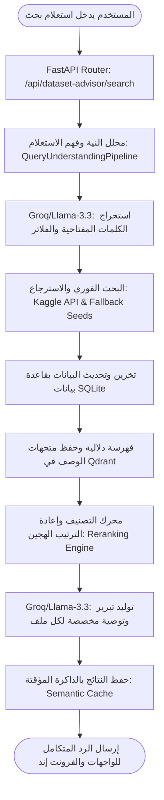

# 🔍 دليل مشروع مستشار البيانات الذكي (AI Dataset Advisor)

مستشار البيانات الذكي (**AI Dataset Advisor**) هو جزء حيوي ونظام فرعي متكامل داخل منصة **SOL Data Agent**. يهدف النظام إلى تمكين المطورين ومحللي البيانات من العثور على مجموعات البيانات (Datasets) المناسبة لمشاريع الذكاء الاصطناعي وتعلم الآلة عن طريق استعلامات بحث طبيعية ثنائية اللغة (العربية والإنجليزية)، ومن ثم تقديم توصيات ذكية مدعومة بالذكاء الاصطناعي وتفسير سبب ملاءمة هذه البيانات للمشروع.

---

## 📌 الفكرة العامة وسير العمل (Workflow)

يقوم مستشار البيانات بمعالجة طلبات البحث الذكية عبر المراحل التالية:



---

## ⚡ المميزات الرئيسية

### 1. فهم الاستعلامات وتحليل النية (Query Understanding)
يستخدم النظام الذكاء الاصطناعي عبر واجهة Groq لترجمة استعلامات البحث (سواء كانت بالعامية أو الفصحى أو الإنجليزية) وتحويلها إلى كائن بيانات منظم (Structured Object) يحتوي على:
*   **المهمة المطلوبة (Task Type):** مثل (Classification, Regression, NLP, Computer Vision).
*   **نوع البيانات (Modality):** مثل (Tabular, Text, Image, Audio, Time-series).
*   **اللغة المستهدفة (Language):** مثل (Arabic, English, Multilingual).
*   **قيود الحجم (Row Constraints):** الحد الأدنى والحد الأقصى للصفوف المطلوبة.
*   **استعلام بحث محسن لكاجل (Primary Kaggle Query):** كلمات مفتاحية إنجليزية قصيرة ومحسنة للبحث الفوري.

### 2. البحث متعدد المصادر والتخزين المؤقت (Multi-Source Retrieval)
*   **البحث الفوري (Live Kaggle Retrieval):** استخدام مكتبة كاجل الرسمية للبحث الديناميكي الفوري وجلب أفضل 15 نتيجة تطابق الكلمة المفتاحية الأساسية والبديلة.
*   **بذور البيانات المحلية (Fallback Seeds):** في حال عدم توفر اتصال بالإنترنت أو عدم تهيئة مفاتيح كاجل، يعود النظام تلقائياً للبحث داخل قاعدة بيانات محلية منتقاة بعناية تحتوي على مجموعات بيانات قياسية ثنائية اللغة (مثل ASTD لتحليل المشاعر باللغة العربية، وبيانات التنبؤ بأسعار المنازل، ومجموعات تتبع المركبات).
*   **الفهرسة الدلالية (Semantic Indexing):** يقوم النظام بتحويل أوصاف البيانات وعناوينها لمتجهات عددية وتخزينها في قاعدة بيانات المتجهات **Qdrant** لتسريع البحث الدلالي.

### 3. محرك التصنيف وإعادة الترتيب الهجين (Hybrid Reranking & Scoring)
لحساب مدى ملاءمة كل ملف بيانات مع طلب المستخدم، يتم احتساب نقاط ملاءمة دقيقة موزعة كالتالي:

| المعيار | النسبة من النتيجة النهائية | آلية الاحتساب |
| :--- | :--- | :--- |
| **التطابق الدلالي للمحتوى (Semantic Content)** | **40%** | حساب جيب التمام (Cosine Similarity) بين متجه استعلام المستخدم ومتجه وصف وعنوان البيانات الفعلي. |
| **تطابق نوع المهمة (Task Fit)** | **20%** | التحقق من مطابقة نوع مهمة تعلم الآلة المحددة (مثل Regression أو Classification). |
| **تطابق بنية البيانات (Modality Fit)** | **15%** | فحص تطابق نوع الملف وبنيته (جداول Tabular أو نصوص NLP أو صور Vision) مع الاستعلام. |
| **تطابق اللغة (Language Fit)** | **15%** | التحقق من لغة البيانات وتطبيق عقوبات جزائية في حال عدم مطابقتها للغة المطلوبة (مثل البحث عن بيانات عربية وعودة بيانات إنجليزية). |
| **التوافق مع قيود الحجم (Row Bounds Size)** | **10%** | احتساب عقوبة تدريجية مستمرة (Continuous Progressive Penalty) عند تجاوز الحد الأقصى للصفوف أو عدم بلوغ الحد الأدنى. |

### 4. التبرير الذكي وتوليد التوصيات (AI Strategy & Reasoning)
يقوم محرك الذكاء الاصطناعي بتحليل البيانات المقترحة لكل نتيجة وكتابة تبرير (Reasoning) باللغة التي استعلم بها المستخدم (العربية أو الإنجليزية)، يشرح بدقة سبب اختيار هذا الملف البرمجي وكيف يخدم مشروعه، مع إمكانية توجيهه بضغطة زر إلى استوديو **AutoML** لتدريب النموذج مباشرة.

---

## 🛠️ البنية البرمجية وهيكل الملفات

تتوزع ملفات المشروع داخل مجلد `backend/tools/dataset_advisor` كالتالي:

```
backend/tools/dataset_advisor/
├── config.py                 # إعدادات المشروع (مفاتيح API، مسارات قاعدة بيانات SQLite، إعدادات Qdrant)
├── router.py                 # مسارات ونقاط وصول FastAPI لعمليات البحث وعرض الإحصائيات
├── db/
│   ├── qdrant.py             # إدارة اتصال وعمليات قاعدة بيانات المتجهات Qdrant
│   └── session.py            # إدارة جلسات الاتصال غير المتزامنة مع قاعدة بيانات SQLite (SQLAlchemy)
├── models/
│   ├── database.py           # الجداول البرمجية (Datasets, SearchLogs, Recommendations) لـ SQLAlchemy
│   └── schemas.py            # هياكل التحقق من البيانات والردود المدخلة والمخرجة لـ Pydantic
└── services/
    ├── cache_service.py      # ذاكرة مؤقتة دلالية سريعة لحفظ نتائج استعلامات البحث المتطابقة لمنع التكرار
    ├── embedding_service.py  # محول متجهات محلي غير متزامن يعتمد على النموذج متعدد اللغات MiniLM
    ├── llm_service.py        # واجهة اتصال غير متزامنة مع Groq لتوليد النصوص والردود بصيغة JSON المهيكلة
    ├── query_understanding.py# خط معالجة وفهم نوايا واستخلاص فلاتر طلب البحث
    ├── retrieval_pipeline.py # الأنبوب الرئيسي المنسق لعمليات البحث والدمج والتصنيف والتبرير
    └── ingestion/
        ├── base.py           # الطبقة الأساسية المجردة لمزودي البيانات
        ├── kaggle_provider.py # مزود بيانات Kaggle والتعامل مع حالات عدم الاتصال والبذور المحلية
        └── orchestrator.py    # منسق عمليات جلب وتجميع وتحديث البيانات
```

---

## ⚙️ التفاصيل التقنية وعينات الكود

### 1. إعدادات المتغيرات البيئية والتخزين (`config.py`)
يعتمد النظام على المكونات التقنية التالية للتشغيل المحلي والسحابي السلس:
```python
EMBEDDING_MODEL_NAME = "sentence-transformers/paraphrase-multilingual-MiniLM-L12-v2" # لإنشاء المتجهات ثنائية اللغة
GROQ_MODEL = "llama-3.3-70b-versatile" # لتوليد الردود والتحليلات البرمجية السريعة
DATASET_ADVISOR_DB_URL = "sqlite+aiosqlite:///./backend/data/advisor.db" # للتخزين الدائم
VECTOR_DB_URL = "local_storage" # التخزين المحلي لـ Qdrant
VECTOR_DB_PATH = "./backend/data/qdrant_storage" # مسار حفظ متجهات البحث
```

### 2. محرك فهم وتفكيك الاستعلام (`query_understanding.py`)
يقوم بتحويل النصوص الحرة إلى فلاتر محددة عبر النموذج اللغوي:
```python
class ParsedQueryIntent(BaseModel):
    task_type: Optional[str] = Field(None, description="نوع مهمة تعلم الآلة")
    modality: Optional[str] = Field(None, description="هيكل البيانات المطلوبة")
    language: Optional[str] = Field(None, description="لغة البيانات المطلوبة")
    max_rows: Optional[int] = Field(None, description="الحد الأقصى لعدد الصفوف")
    min_rows: Optional[int] = Field(None, description="الحد الأدنى لعدد الصفوف")
    topic: Optional[str] = Field(None, description="الموضوع الأساسي للبيانات")
    primary_kaggle_query: str = Field(..., description="كلمة مفتاحية قصيرة بالإنجليزية للبحث في كاجل")
    detected_language: str = Field("english", description="لغة استعلام المستخدم")
```

### 3. الحساب التلقائي لنقاط الملاءمة وعقوبات الحجم (`retrieval_pipeline.py`)
يقوم الأنبوب بحساب مدى التوافق ومعاقبة الأحجام الزائدة نسبياً:
```python
# احتساب التوافق مع حجم البيانات الأقصى (عقوبة تدريجية مستمرة)
size_fit = 1.0
if intent.max_rows and ds.row_count:
    if ds.row_count <= intent.max_rows:
        size_fit = 1.0
    else:
        ratio = ds.row_count / intent.max_rows
        if ratio <= 1.5:
            size_fit = 0.8
        elif ratio <= 3.0:
            size_fit = 0.5
        elif ratio <= 10.0:
            size_fit = 0.2
        else:
            size_fit = 0.05
```

---

## 🗄️ تفاصيل وهيكل قاعدة البيانات (SQL Schema)

يحتوي النظام على 3 جداول أساسية مرتبطة كالتالي:

```
┌────────────────────────┐         ┌────────────────────────┐
│        datasets        │         │      search_logs       │
├────────────────────────┤         ├────────────────────────┤
│ id (PK) [String]       │         │ id (PK) [String]       │
│ kaggle_id (UQ) [String]│         │ session_id [String]    │
│ title [String]         │         │ query_text [Text]      │
│ description [Text]     │         │ detected_lang [String] │
│ url [String]           │         │ extracted_filters [JSON]│
│ row_count [Integer]    │         │ created_at [DateTime]  │
│ column_count [Integer] │         └───────────┬────────────┘
│ license [String]       │                     │
│ task_type [String]     │                     │
│ language [String]      │                     │
│ tags [JSON]            │                     │
│ quality_score [Float]  │                     │
│ created_at [DateTime]  │                     │
└───────────┬────────────┘                     │
            │                                  │
            │            ┌─────────────────────┘
            ▼            ▼
┌────────────────────────┐
│    recommendations     │
├────────────────────────┤
│ id (PK) [String]       │
│ log_id (FK) [String]   │◄--- مرتبطة بسجل البحث
│ dataset_id (FK)[String]│◄--- مرتبطة بملف البيانات
│ relevance_score [Float]│
│ reasoning [Text]       │◄--- التفسير المقنع المولد بالذكاء الاصطناعي
│ created_at [DateTime]  │
└────────────────────────┘
```

---

## 🌐 واجهة برمجة التطبيقات (API Endpoints)

يقوم المستشار بتوفير نقطتي وصول أساسيتين للتعامل مع العمليات:

### 1. البحث الدلالي الشامل
*   **الرابط:** `/api/dataset-advisor/search`
*   **النوع:** `POST`
*   **المدخلات:**
    ```json
    {
      "query": "أريد مجموعة بيانات جداول عربية للتنبؤ بأسعار المنازل أقل من 20000 صف",
      "session_id": "user_session_abc123"
    }
    ```
*   **المخرجات:** تحليل الاستعلام، الرد الترحيبي المناسب، قائمة بمجموعات البيانات الموصى بها مصنفة بنسبة ملاءمة مئوية مع التبرير المكتوب خصيصاً لكل ملف.

### 2. إحصائيات النظام والمراقبة
*   **الرابط:** `/api/dataset-advisor/stats`
*   **النوع:** `GET`
*   **المخرجات:** يعيد عدد الملفات المفهرسة محلياً، عدد عمليات البحث المسجلة، عدد التوصيات الكلية، وحالة قاعدة بيانات المتجهات **Qdrant** (Active/Fallback) مع نوع محرك قاعدة البيانات المستخدم.

---

## 🎨 واجهة المستخدم الرسومية (UI Design)

تتميز واجهة مستشار البيانات بمظهر وتجربة استخدام راقية تتناسب مع طابع المنصة:
1.  **ألوان وتأثيرات Ambient:** خلفية زجاجية شفافة (Glassmorphism) تتداخل فيها إضاءات النيون النيلية والسيان المتدرجة مع مؤثرات ضبابية (Backdrop Blur).
2.  **لوحة الإحصائيات الفورية (Live Monitor Panel):** تعرض حالة النظام وقاعدة البيانات وعدد العناصر المفهرسة في الوقت الفعلي.
3.  **مدخلات البحث والاقتراحات الجاهزة:** مدعومة بـ Textarea ديناميكي تفاعلي وأزرار دائرية صغيرة (Pills) لاقتراح استعلامات بحث جاهزة للمستخدم لتسهيل البداية.
4.  **شاشات التحميل التفاعلية (Shimmer Loading):** تعطي شعوراً حياً وتفاعلياً للمستخدم أثناء انتظار معالجة نية البحث واسترجاع البيانات.
5.  **حلقات قياس مدى الملاءمة (Relevance Score Rings):** رسومات دائرية متحركة بحواف مضيئة تظهر النسبة المئوية لمدى ملاءمة مجموعة البيانات للهدف بدقة وسرعة.
