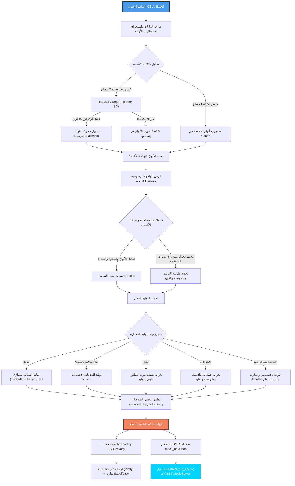

# 🧬 مخطط تدفق العمل الكامل — SOL Platform Workflow

يصف هذا المستند مسار تدفق البيانات والتفاعل البرمجي الكامل داخل منصة **SOL** لتوليد البيانات الاصطناعية، بدءاً من لحظة قيام المستخدم برفع ملف البيانات وحتى تصديرها كـ REST API محلي متكامل.

---

## 🗺️ مخطط تدفق البيانات والعمليات (System Flowchart)

يوضح المخطط التالي دورة حياة البيانات والعمليات البرمجية داخل المنصة:



---

## 📋 تفاصيل مراحل العمل (Phase-by-Phase Breakdown)

### 1️⃣ مرحلة القراءة والتحليل الإحصائي الأولي (Parsing & Profiling)
*   **رفع الملف:** يرفع المستخدم ملف CSV أو Excel عبر عنصر `st.file_uploader` في واجهة Streamlit.
*   **مسح الذاكرة الديناميكي:** إذا تم رفع ملف جديد، يقوم النظام تلقائياً بمسح الذاكرة المؤقتة (`st.session_state`) للملف السابق لمنع خلط البيانات والتقارير.
*   **استخراج الإحصائيات الرياضية:** يقوم المحرك بحساب أولي لنسبة القيم الفارغة (Null %)، عدد القيم الفريدة (Uniques %)، القيم الصغرى والعظمى للأرقام، وجداول توزيع التكرار للفئات. يتم استخدام مكتبة `Pandas` بشكل متوازي ومتجهيز (Vectorized) لتحقيق سرعة تشغيل فائقة.

### 2️⃣ مرحلة فهم البيانات الذكي (Semantic Classification Layer)
*   تقوم المنصة بتمييز الأعمدة الحساسة وأعمدة العمليات وتصنيفها إلى 9 أنواع فريدة:
    1.  `numerical`: بيانات حسابية ذات معنى رياضي.
    2.  `categorical`: قيم فئوية نصية.
    3.  `id_sequence`: أرقام تعريفية متسلسلة (تحتوي أو لا تحتوي على بادئة نصية).
    4.  `pattern_sequence`: نصوص تتبع نمطاً محدداً (مثل أكواد المنتجات).
    5.  `sensitive_name`: أسماء أشخاص.
    6.  `sensitive_email`: بريد إلكتروني.
    7.  `sensitive_phone`: أرقام هواتف.
    8.  `sensitive_address`: عناوين جغرافية.
    9.  `sensitive_id`: أرقام هويات شخصية أو ضمان اجتماعي.
*   **التشخيص بالذكاء الاصطناعي:** يُرسل النظام عينة صغيرة جداً (3 صفوف) إلى نموذج `Llama 3.3` لتحديد الأنواع الفكرية للأعمدة لمنع خلط الأرقام الحسابية بالأرقام الوهمية (مثل عدم خلط الرقم التسلسلي بالراتب).
*   **حماية التجاوز (Timeout & Fallback):** لمنع تجميد النظام عند انقطاع الإنترنت أو بطء الاستجابة، يتم استدعاء الذكاء الاصطناعي في خيط معالجة مستقل (`threading.Thread`) بمهلة أقصاها **10 ثوانٍ**؛ وإذا انتهت المهلة يتم التحول فوراً إلى محرك القواعد البديل (Fallback Engine) الذي يطبق خوارزميات فحص سريعة ومعالجة ذكية للأرقام.

### 3️⃣ مرحلة تخصيص بيئة التوليد (Configuration Lab)
*   **مساعد البيانات (LLM Advisor):** يمكن للمستخدم استشارة الذكاء الاصطناعي بنقرة واحدة لتحليل هيكل الملف وتقديم توصيات مخصصة حول أفضل خوارزمية، عدد دورات التدريب المناسب، وتوجيهات التعامل مع الانحياز والضوضاء.
*   **محرر البيانات (Data Editor):** تعديل مخرجات التحليل يدوياً (تغيير نوع العمود المكتشف، تعديل الحدود الصغرى والقصوى للمتغيرات الرقمية، أو استبعاد بعض الأعمدة نهائياً من التوليد).
*   **تحديد معلمات الخوارزميات:** اختيار خوارزمية التوليد، عدد دورات التدريب (Epochs)، حجم عينة التدريب، ووضع التوليد (استبدال كامل ببيانات وهمية 100% أو توسيع بدمج الأصلي مع الوهمي).
*   **الشروط والضوضاء:**
    *   تفعيل موازنة الفئات لعمود فئوي محدد.
    *   تحديد نسبة حقن القيم الفارغة ونسبة حقن القيم المتطرفة والشاذة.
    *   كتابة شرط تصفية منطقي (Pandas Query) للتوافق مع منطق العمل.

### 4️⃣ مرحلة التوليد الفعلي والمعالجة (Synthesis & Post-Processing)
*   يتم استدعاء الدالة المناسبة من موديول `synthetic.py` بناءً على الخيار المحدد:
    *   **في الأسلوب الإحصائي (Basic):** يتم استغلال ميزة تعدد المسارات البرمجية (`ThreadPoolExecutor`) لتوزيع توليد كل عمود في خيط معالجة مستقل، مما يجعل التوليد الإحصائي ينتهي في أجزاء من الثانية للملفات الكبيرة.
    *   **في أسلوب الذكاء الاصطناعي (TVAE / CTGAN / GaussianCopula):** يتم عزل الأعمدة الحساسة والفريدة وتدريب النموذج فقط على الأعمدة الهيكلية ليتعلم علاقاتها بدقة، ثم يتم توليد الأعمدة الفريدة لاحقاً ودمجها لحماية الخصوصية ومنع تدريب النماذج العصبية على نصوص عشوائية غير قابلة للتعلم.
*   **حقن الضوضاء:** تطبيق معايير مختبر الضوضاء على المخرجات.
*   **تصفية الشروط:** تطبيق استعلام Pandas وإقصاء أي صفوف لا تنطبق عليها شروط منطق العمل.

### 5️⃣ مرحلة التقييم والجودة والخصوصية (Evaluation & Reporting)
*   **Fidelity Report:** حساب جودة محاكاة البيانات الأصلية لكل عمود وإعطاء تقييم نسبي كلي.
*   **Privacy DCR Evaluation:** حساب مقياس المسافة إلى أقرب سجل حقيقي لمنع تشابه السجلات وتسريب البيانات الحقيقية وتصنيف الخطر الأمني للملف الناتج.
*   **الرسومات التفاعلية:** إرسال النتائج إلى واجهة Streamlit لبناء مخططات رادار الجودة، ومقارنات التوزيع، ومصفوفات فرق العلاقات الإحصائية.

### 6️⃣ مرحلة النشر والتصدير (Export & Mock API)
*   **تحميل التقارير:** تنزيل الملفات بصيغة CSV، أو تقرير Excel تفصيلي يحتوي على عدة صفحات (البيانات، التقارير، الإحصائيات، ومصفوفات الارتباط)، أو قاموس البيانات التوثيقي (Data Dictionary) بصيغة Markdown.
*   **نشر الـ Mock API:**
    *   يقوم المستخدم بتحميل البيانات المولدة كملف JSON وحفظه باسم `mock_data.json` في مجلد المشروع.
    *   يتم تشغيل ملف `run_api.py` الذي يستخدم مكتبة `FastAPI` لقراءة هذا الملف فوراً وبناء مسارات REST تفاعلية خفيفة وسريعة تتيح للمطورين جلب البيانات وتصفيتها بالـ ID أو جلب عينة محددة برمجياً.

---

## 🔗 الارتباط البرمجي بين ملفات المشروع (File Interaction Map)

```
┌────────────────────────────────────────────────────────┐
│                        App.py                          │
│             (Streamlit User Interface)                 │
└───────────┬────────────────────────────▲───────────────┘
            │                            │
 1. رفع البيانات والتخصيص               5. عرض التقارير والرسومات
            │                            │
┌───────────▼────────────────────────────┴───────────────┐
│                     synthetic.py                       │
│             (Statistical & AI Engine)                  │
└───────────┬────────────────────────────────────────────┘
            │
 2. توليد البيانات وحفظها بصيغة JSON
            │
┌───────────▼────────────────────────────────────────────┐
│                    mock_data.json                      │
│             (Synthetic JSON Database)                  │
└───────────┬────────────────────────────────────────────┘
            │
 3. قراءة البيانات عند بدء التشغيل
            │
┌───────────▼────────────────────────────────────────────┐
│                      run_api.py                        │
│                 (FastAPI Rest Server)                  │
└───────────────────────────┬────────────────────────────┘
                            │
                 4. استدعاء المطورين للمسارات
                            ▼
                    [REST API Client]
```
