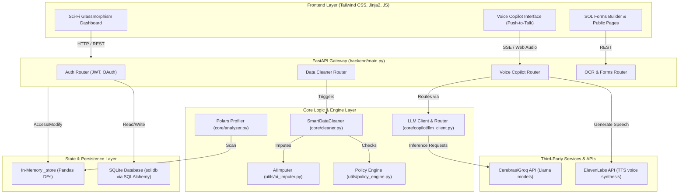

# SOL Data Agent — Enterprise Data Factory
## Senior Engineer Onboarding & Technical Architecture Deep-Dive

Welcome to the **SOL Data Agent** engineering team! This document serves as a comprehensive, production-grade technical manual and onboarding guide. It details the system's architecture, data engineering pipelines, mathematical and machine learning abstractions, security layers, and core workflows.

---

## 1. Project Overview

### 1.1 Project Name
**SOL Data Agent** (نظام وكيل بيانات سول) — Enterprise Data Factory.

### 1.2 Purpose and Vision
The platform is an autonomous, AI-driven data preparation and cleaning engine. It aims to bridge the gap between messy, real-world data and production-ready analytical assets. The system automates descriptive profiling, semantic type mapping, anomalous outlier removal, and predictive missing value imputation. It is wrapped in a high-fidelity dashboard and a voice-interactive Arabic Copilot ("SOL") speaking natural Egyptian Arabic.

### 1.3 Main Problem Being Solved
Data scientists and business analysts spend **60% to 80%** of their time preparing and cleaning raw data rather than building models. 
- **Data Quality Issues:** Messy string formats, erratic datetime encodings, high missingness ratio, spelling inconsistencies (fuzzy typos), and statistical outliers.
- **Resource Constraints:** Heavy data analysis processes risk causing Out-Of-Memory (OOM) exceptions on client web browsers or small servers.
- **Complexity Barrier:** Standard ML model building (feature engineering, hyperparameter tuning, validation) requires complex boilerplate code.
- **User Interface Friction:** Traditional interfaces are rigid. Non-technical users cannot easily query, plot, or clean data using natural, voice-driven commands.

### 1.4 Target Users and Customers
- **Enterprise Data Analysts:** Who need rapid, high-integrity data sanitization before loading into BI tools.
- **Machine Learning Engineers & Data Scientists:** Who need high-integrity cleaned data for custom modeling.
- **Non-Technical Business Owners:** Who interact with data via the voice copilot to generate instant charts and reports.

### 1.5 Key Business Goals
1. **Reduce Time-to-Clean:** Automate standard cleaning pipelines (Alpha, Beta, Gamma levels) from hours to seconds.
2. **Ensure Data Governance:** Enforce corporate security policies (e.g., blocking row drops on primary keys or exposing PII columns).
3. **Minimize Compute Overhead:** Optimize data pipelines to run efficiently on resource-constrained local environments.
4. **Delight Users:** Deliver a modern "Sci-Fi" dashboard utilizing Glassmorphism aesthetics and low-latency voice-to-voice interaction.

---

## 2. Core Features

| Feature Name | Functional Details | User Flow | Business Justification |
| :--- | :--- | :--- | :--- |
| **Universal Loader** | Supports CSV, Excel (`.xlsx`/`.xls`), JSON, XML, Parquet, Feather, HDF5, and ORC. | User drags/drops any supported file on the dashboard. The DataLoader factory instantiates the correct parser and registers the dataset in the memory store. | Prevents pipeline failures caused by file format discrepancies. |
| **Smart Data Cleaner** | Offers Alpha, Beta, and Gamma cleaning. Runs outlier removal, date standardization, fuzzy spelling correction, and email/phone regex cleaning. | User selects cleaning level or individual columns to clean in the Cleaning Studio. Preview shows highlighted "before vs. after" cell diffs. | Guarantees semantic and statistical consistency across the dataset. |
| **AI Imputer Engine** | Imputes missing values using random forest regressions/classifications over a sliced 1D feature index. | Integrated into the cleaning studio. Triggers automatically when "Smart Impute" is selected for missing fields. | outperforms basic mean/median/mode fillers by preserving multi-feature correlation. |
| **SOL Voice Copilot** | Egyptian Arabic voice assistant. Routes greetings (`CHAT`) and operations (`COMMAND`). | User presses push-to-talk, speaks in Egyptian Arabic (e.g., "طير عمود السن"), the system executes code, replies in Egypt-colloquial text (under 25 words), and plays ElevenLabs TTS. | Enables hands-free, high-speed data manipulation via conversational AI. |
| **Visualizer & Auditor** | Displays interactive charts (distributions, correlations) and tracks every modification. | User clicks "Viz Report" or downloads the audit trail PDF. | Ensures transparency, auditability, and compliance in enterprise environments. |
| **OCR & SOL Forms** | Extracts structured fields from images/PDFs and builds public forms to capture data directly. | User uploads a form image or creates a form layout. Public links accept submissions and save them directly as DataFrames. | Captures structured data at the source, preventing dirty data ingestion. |

---

## 3. System Architecture

### 3.1 High-Level Architecture Diagram
The following diagram illustrates how the frontend components, FastAPI routers, memory stores, database, and third-party APIs connect:



### 3.2 Frontend Components
- **Template Inheritance System:** A master template (`_layout.html`) houses the Sidebar Navigation, Rates/Token monitors, and user session initializers.
- **Glassmorphism Layouts:** Modern CSS components leveraging transparent backgrounds, backdrop blurs, and neon borders (`Electric Cyan` and `Indigo`).
- **Interactive Audio Visualizer:** Dynamic CSS keyframe animations that mirror voice recording states.
- **Fetch Client Middleware:** An asynchronous JavaScript layer that reads JWT tokens from cookies or local storage, handles client-side errors, and updates the DOM dynamically.

### 3.3 Backend Components
- **FastAPI Gateway (`backend/main.py`):** Configures rate-limiting, handles CORS, mounts static assets, manages exception handling, and loads subsystem routers.
- **Modular Routers:** Segmented routing files for Authentication, Copilot, OCR, Semantic Mapping, and Data Noise.
- **In-Memory Store Manager (`backend/store.py`):** Acts as a high-speed, thread-safe memory mapping system that stores active DataFrames using unique UUIDs.

### 3.4 Storage & Databases
- **SQLite Database (`backend/data/sol.db`):** Stores structured relational data for users, audit logs, authentication history, forms, and responses.
- **SQLAlchemy ORM (`backend/database.py`):** Provides an Object-Relational Mapping layer with connection pool controls and thread isolation.

### 3.5 Third-Party Services
- **Cerebras & Groq APIs:** Execute ultra-low latency LLM inference queries (Llama-3/Llama-4 models).
- **ElevenLabs TTS API:** Dynamically synthesizes written Egyptian Arabic text into professional voice files.

---

## 4. Technical Stack

```
   ┌──────────────────────────────────────────────────────────┐
   │                     PROGRAMMING LANGUAGES                │
   │            Python 3.11 (Backend) | Modern JavaScript     │
   └───────────────────────────┬──────────────────────────────┘
                               │
   ┌───────────────────────────▼──────────────────────────────┐
   │                     FRAMEWORKS & UTILITIES               │
   │         FastAPI (HTTP/SSE) | Tailwind CSS | Jinja2       │
   └───────────────────────────┬──────────────────────────────┘
                               │
   ┌───────────────────────────▼──────────────────────────────┐
   │                 DATA SCIENCE & MODELING ENGINE           │
   │   Pandas | Polars | NumPy | Scikit-Learn | XGBoost | LightGBM│
   └───────────────────────────┬──────────────────────────────┘
                               │
   ┌───────────────────────────▼──────────────────────────────┐
   │                 INFRASTRUCTURE & ENVIRONMENT             │
   │ SQLite (Relational Store) | Uvicorn (ASGI) | Windows/Linux │
   └──────────────────────────────────────────────────────────┘
```

- **CI/CD Target:** GitHub Actions triggers automated formatting checks and runs unit tests via `pytest tests/` on code changes.
- **Deployment Targets:** Local batch execution (`run_project.bat`) or cloud deployments using Docker containers.

---

## 5. Data Flow

```
Raw File Upload ──► Universal Loader ──► Register in Memory Store (_store)
                                              │
      ┌───────────────────────────────────────┴───────────────────────────────────────┐
      ▼                                                                               ▼
Polars Profiler                                                               Data Cleaner Studio
- Scan CSV/Parquet                                                            - Read columns & policies
- Stream stats (nulls, unique)                                                - Run AIImputer & Normalizers
- Output JSON schema                                                          - Store cleaned copy in _store
```

1. **Upload & Ingestion:** The raw file is uploaded. The `DataLoaderFactory` reads the stream in memory. It is converted to a Pandas DataFrame and stored in `_store[dataset_id]`.
2. **Analysis & Profiling:** The Polars profiling engine performs a lazy scan of the dataset to extract row/column shapes, missing percentages, and target recommendations.
3. **Data Transformation & Cleaning:** When the user selects a cleaning level (Alpha, Beta, or Gamma), the strategy is parsed by the `SmartDataCleaner`. The `PolicyEngine` validates each step. The DataFrame in the memory store is updated, and the changes are logged in `_audit_store`.
4. **Persistence & Export:** The cleaned dataset is exported as a CSV/Excel file. Transactional data (users, forms, audit trails) are persisted to the SQLite database.

---

## 6. Core Business Logic & Algorithms

### 6.1 Polars Streaming Profiler (`MetadataAnalyzer`)
To prevent OOM failures on large datasets, the profiler avoids loading files directly into memory:
```python
# Streaming nulls and cardinality check using Polars
lf = pl.scan_csv(file_path, infer_schema_length=10000)
select_exprs = []
for col in lf.columns:
    select_exprs.append(pl.col(col).null_count().alias(f"{col}_nulls"))
    select_exprs.append(pl.col(col).n_unique().alias(f"{col}_unique"))
stats_df = lf.select(select_exprs).collect(streaming=True)
```
This execution uses the Polars streaming optimizer, keeping memory usage minimal.

### 6.2 AI Imputer Engine (`AIImputer`)
Instead of simple mean or mode imputation, the system uses a random forest predictive model:
1. **Identify Missingness:** Locates target indices where the target column is null.
2. **Feature Slicing:** Extracts all non-null columns that do not violate governance rules to act as feature variables ($X$).
3. **Encoding & Preparation:** Standardizes numeric columns and encodes categorical variables.
4. **Model Training:** Fits a `RandomForestClassifier` (for categorical columns) or `RandomForestRegressor` (for numerical columns).
5. **Prediction & Re-insertion:** Predicts values for missing cells and inserts them back into the DataFrame.

### 6.4 Copilot ReAct Routing Loop
The Copilot uses a two-agent architecture:
1. **Gateway Agent (`refine_user_input`):** Classifies the user's input as `CHAT` (social chat) or `COMMAND` (data operation).
2. **ReAct Execution Agent:** If classified as a `COMMAND`, the agent writes a Python script. This script runs in a sandbox (`execute_pandas_code`). If the script does not update the DataFrame as expected, the system catches this and prompts the LLM to rewrite the script:
```python
if (not mutated and _code_intends_mutation(code)):
    # Feed back mutation warning, force ReAct loop to retry
```

---

## 7. Database Schema & Data Persistence

The database engine is built on **SQLAlchemy ORM** and uses a local SQLite file.

```
                  ┌───────────────────────┐
                  │         users         │
                  ├───────────────────────┤
                  │ id (PK) [INT]         │
                  │ email (UQ) [STR]      │
                  │ username (UQ) [STR]   │
                  │ hashed_password [STR] │
                  │ status [STR]          │
                  │ created_at [DATETIME] │
                  └───────────┬───────────┘
                              │
            ┌─────────────────┴─────────────────┐
            ▼                                   ▼
┌───────────────────────┐           ┌───────────────────────┐
│     otp_sessions      │           │       auth_logs       │
├───────────────────────┤           ├───────────────────────┤
│ id (PK) [INT]         │           │ id (PK) [INT]         │
│ email (FK) [STR]      │           │ email [STR]           │
│ otp_hash [STR]        │           │ action [STR]          │
│ expires_at [DATETIME] │           │ status [STR]          │
│ attempts [INT]        │           │ details [STR]         │
│ is_verified [BOOL]    │           │ timestamp [DATETIME]  │
└───────────────────────┘           └───────────────────────┘

┌───────────────────────┐           ┌───────────────────────┐
│         forms         │           │       responses       │
├───────────────────────┤           ├───────────────────────┤
│ id (PK) [INT]         │◄──────────┤ id (PK) [INT]         │
│ title [STR]           │           │ form_id (FK) [INT]    │
│ description [TEXT]    │           │ answers [JSON]        │
│ questions [JSON]      │           │ timestamp [DATETIME]  │
└───────────────────────┘           └───────────────────────┘
```

### 7.1 Database Table Details

#### Table: `users`
- Stores user credentials, profiles, and verification states.
- Columns: `id` (Integer, Primary Key), `first_name` (String), `last_name` (String), `username` (String, Unique), `email` (String, Unique), `hashed_password` (String), `status` (String, Default: `"active"`), `job_title` (String), `organization` (String), `created_at` (DateTime).

#### Table: `otp_sessions`
- Manages 6-digit OTP codes hashed with SHA-256 for email verification security.
- Columns: `id` (Integer, Primary Key), `email` (String, Index), `otp_hash` (String), `expires_at` (DateTime), `attempts` (Integer, Default: `0`), `is_verified` (Boolean), `created_at` (DateTime), `updated_at` (DateTime).

#### Table: `auth_logs`
- Stores security logs, login tracking, and audit trails.
- Columns: `id` (Integer, Primary Key), `ip_address` (String), `email` (String), `user_agent` (String), `action` (String), `status` (String), `details` (String), `timestamp` (DateTime).

#### Table: `forms`
- Stores custom forms created by users.
- Columns: `id` (Integer, Primary Key), `title` (String), `description` (Text), `questions` (JSON - stores field schemas: types, questions, option lists), `created_at` (DateTime).

#### Table: `responses`
- Stores responses submitted to custom forms.
- Columns: `id` (Integer, Primary Key), `form_id` (Integer, Foreign Key to `forms.id`), `answers` (JSON - maps questions to submitted answers), `timestamp` (DateTime).

---

## 8. API Design & Integration Points

The platform exposes REST endpoints and Server-Sent Events (SSE) for real-time streaming:

### 8.1 Key API Endpoints

#### Authentication & Verification
- `POST /api/v1/auth/register` — Registers a new user. Generates a 6-digit OTP code and sends it via a background task.
- `POST /api/v1/auth/verify-otp` — Validates the OTP. On success, it returns a JWT token and sets auth cookies.
- `POST /api/v1/auth/login` — Authenticates credentials and returns a JWT token.
- `GET /api/v1/auth/google/login` & `GET /api/v1/auth/github/login` — Redirects users to OAuth identity providers.

#### AutoML Studio
- `GET /api/automl/datasets` — Lists all active datasets in the memory store.
- `POST /api/automl/upload-direct` — Accepts file uploads (multipart/form-data), profiles the data in memory, and returns metadata.
- `POST /api/automl/train` — Starts the AutoML pipeline. Returns an SSE stream (`text/event-stream`) that pushes real-time training steps and Kaggle notebook logs:
  ```json
  event: progress
  data: {"event": "progress", "step": "Preprocessing", "desc": "Scaling features...", "percent": 20}
  ```
- `POST /api/automl/export` — Packages the trained model pipeline, preprocessor, and a PDF report into a ZIP file.

#### Voice Copilot (SOL)
- `POST /api/copilot/chat` — Processes messages through the ReAct loop and returns text responses.
- `GET /api/copilot/schema/{dataset_id}` — Returns the schema of a dataset directly from memory, avoiding LLM calls.
- `POST /api/copilot/tts` — Converts text responses into MP3 audio streams.

---

## 9. Security & Access Control

### 9.1 Authentication & Cookies
The backend uses **JWT (JSON Web Tokens)** for stateless authentication. It sets two cookies upon a successful login:
1. `access_token` (HTTPOnly, SameSite=Strict): Secured cookie containing the user's identity token.
2. `sol_auth_token` (SameSite=Strict): Frontend-accessible cookie used to check session status and display user details.

### 9.2 Rate Limiting Middleware (`SimpleRateLimiter`)
Protects endpoints from abuse:
- It tracks client IP addresses in memory.
- It limits clients to a maximum of **30 requests per minute**. Excess requests return an HTTP `429 Too Many Requests` status code.

### 9.3 Sandbox Code Execution Safety
Pandas code execution requested by the Copilot runs in a separate execution block:
- The system checks code snippets for unsafe commands (e.g., `os.system`, `subprocess`, `open`, `eval`, `exec`, `globals`, `locals`) before execution.
- Variables are isolated inside local dictionary bindings, preventing access to global system resources.

### 9.4 Replay Protection & Security Hardening
- **OTP Lockout:** Users are locked out after 5 failed OTP attempts. Code reuse is blocked by verification flags.
- **Fast Client Failures:** Connection attempts fail quickly (`max_retries=0`) rather than hanging if downstream services (like Cerebras or Groq) are rate-limited.

---

## 10. UI/UX Design & User Experience

### 10.1 Theme & Styling
- **Aesthetic:** Glassmorphism with deep navy and dark gray surfaces (`#111220` and `#191b28`) paired with neon cyan and indigo accents (`#bac3ff`, `#4361ee`).
- **Typography:** Uses `Inter` for readability, `Space Grotesk` for numbers and titles, and `JetBrains Mono` for code blocks.
- **Responsive Layout:** Dynamic grid panels collapse on mobile devices, keeping the sidebar accessible.

### 10.2 Voice Feedback Animations
- The push-to-talk button includes a CSS ripple animation that mirrors the audio capture state.
- While the backend processes audio, a skeleton loader displays until the synthesized voice starts playing.

---

## 11. Performance & Scalability

### 11.1 Polars vs. Pandas Strategy
- **Profiling:** The system scans datasets using Polars (`pl.scan_csv`) and streams statistics with `collect(streaming=True)`. This minimizes memory usage during initial profiling.
- **In-Memory Store:** The system stores data in-memory during active sessions. Cleaned datasets are converted back to Pandas DataFrames for quick updates.

### 11.2 Parallel Task Offloading
Heavy CPU-bound tasks, such as PDF report generation, are offloaded to a thread pool executor:
```python
_executor = ThreadPoolExecutor(max_workers=2)
# Run CPU-bound processing/generation without blocking the main event loop
await loop.run_in_executor(_executor, generate_pdf_report, ...)
```
This ensures the web server remains responsive while executing intensive tasks.

---

## 12. Third-Party Integrations

### 12.1 Cerebras API Integration
The voice copilot uses the **Cerebras Inference API** to process Arabic requests. It utilizes the Llama-3/Llama-4 models for quick responses, avoiding the rate limits of other platforms.

### 12.2 ElevenLabs TTS Integration
The system translates Egyptian Arabic text into natural-sounding audio streams:
- It uses a custom voice ID configured for natural Egyptian dialect.
- It caches audio buffers to reduce latency and save API credits on repeated phrases.

---

## 13. Edge Cases & Safeguards

### 13.3 ReAct Loop Safeguards
- **Throttling:** The system uses a short cooldown (`await asyncio.sleep(2)`) between ReAct loops to prevent rate limits.
- **No-Change Warning:** If an LLM-generated code snippet runs successfully but does not modify the data, the system flags the issue and prompts the LLM to rewrite the script.

---

## 14. Future Roadmap

1. **Local Model Runtimes:** Add support for running lightweight, local models (e.g., Llama-3-8B via Ollama) to support offline deployments.
2. **Improved Speech Processing:** Move voice activity detection (VAD) to the client side to reduce audio processing latency.
3. **Offline Voice Synthesis:** Add support for browser-based text-to-speech synthesis to reduce external API dependency.

---

## 15. Setup & Onboarding Guide

### 15.1 Prerequisites
Ensure you have the following installed:
- **Python 3.10 or 3.11** (Check with `python --version`)
- **Git**

### 15.2 Step-by-Step Installation

1. **Clone the Repository:**
   ```powershell
   git clone <repository_url>
   cd run
   ```

2. **Configure Environment Variables:**
   Create a `.env` file in the root folder and add your API keys:
   ```env
   # LLM Providers (Cerebras, Groq, or OpenAI)
   CEREBRAS_API_KEY=csk-w4w6vmjy346p8jp62wwdknj9v48rjctj5cpp46mr5x28r34j
   GROQ_API_KEY=your_groq_api_key
      # Voice Synthesis
    ELEVENLABS_API_KEY=your_elevenlabs_key
    
    # Application Settings
   SECRET_KEY=b91a603957beab8d956f2f9f98f6d89bdfad741df747372cf91c0e358b68832a
   BACKEND_BASE_URL=http://localhost:8000
   ```

3. **Install Dependencies:**
   ```powershell
   pip install -r requirements.txt
   ```

4. **Initialize the Database:**
   Run migrations to set up the SQLite database:
   ```powershell
   python backend/migrate_db.py
   ```

5. **Start the Application:**
   Run the startup batch script:
   ```powershell
   .\run_project.bat
   ```
   Or run the Uvicorn server manually:
   ```powershell
   uvicorn backend.main:app --reload --port 8000
   ```

6. **Verify the Installation:**
   Run the test suite to ensure everything is working correctly:
   ```powershell
   python -m pytest tests
   ```

7. **Access the Application:**
   Open your browser and navigate to `http://localhost:8000` to access the dashboard.
