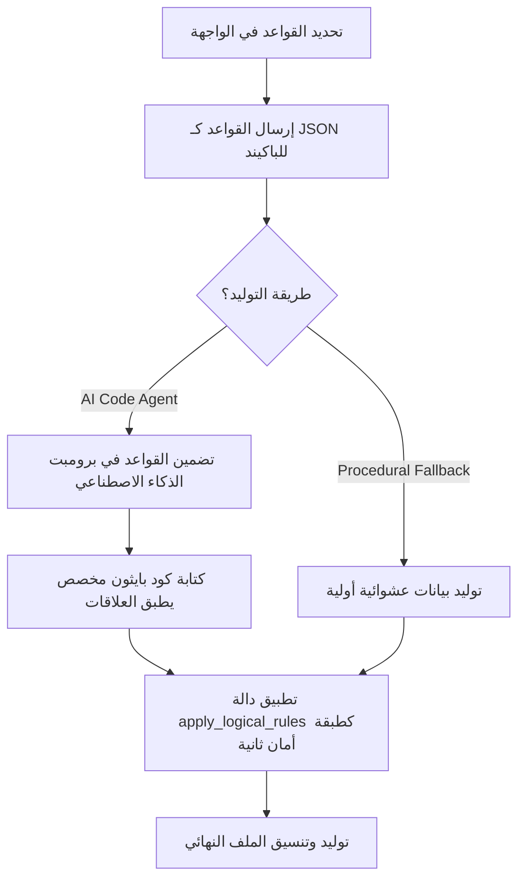

# دليل ميزة استوديو البيانات الاصطناعية (Synthetic Data Studio Guide)

استوديو البيانات الاصطناعية (Synthetic Data Studio) هو وحدة متكاملة داخل تطبيق **SOL Data Agent** مصممة لتوليد بيانات اصطناعية عالية الجودة والدقة الإحصائية (High-Fidelity Synthetic Datasets) لأغراض تدريب نماذج التعلم الآلي، وحماية خصوصية البيانات، وتوليد سيناريوهات اختبار مخصصة.

---

## 1. بنية الملفات والوظائف الرئيسية (File Map & Architecture)

تتوزع الميزة على ثلاثة أجزاء رئيسية في المشروع:

### أ. الواجهة الأمامية (Frontend HTML/JS)
*   **الملف:** `frontend/templates/app/synthetic_studio.html`
*   **الوصف:** واجهة تفاعلية تمكّن المستخدم من:
    1.  رفع ملفات البيانات الأصلية لتحليلها وتوليد محاكاة لها.
    2.  تصميم هيكل الجدول (Schema Designer) وتحديد أسماء الأعمدة وأنواعها (IDs, Numbers, Category, Text, Dates).
    3.  **محرر القواعد المنطقية والربط (Rules Editor):** يتيح فرض اعتمادات رياضية ومنطقية صارمة بين الأعمدة لمنع توليد بيانات متناقضة.
    4.  استعراض البيانات المولدة في جدول تفاعلي، ومراجعة تقارير جودة التوليد والخصوصية.

### ب. مسارات الباكيند والمنافذ (API Routes)
*   **الملف:** `backend/tools/synthetic_data/router.py`
*   **الوصف:** يستقبل طلبات الواجهة ويدير عمليات التوليد:
    *   `POST /api/synthetic/upload`: رفع ملفات البيانات الأصلية وتحويلها إلى Parquet.
    *   `POST /api/synthetic/generate`: توليد البيانات عبر النماذج الإحصائية المحلية (Basic, Gaussian Copula, TVAE, CTGAN).
    *   `POST /api/synthetic/prompt/generate`: توليد البيانات بناءً على الهيكل وقواعد الربط المرسلة عبر طلب المستخدم.
    *   `GET /api/synthetic/download/{dataset_id}`: تصدير وتنزيل البيانات كملف CSV مع معالجة ترميز UTF-8 وتنسيقات التصدير.

### ج. محرك التوليد والذكاء الاصطناعي (Core Engine)
*   **الملف:** `backend/tools/synthetic_data/engine.py`
*   **الوصف:** يحتوي على المنطق البرمجي الفعلي للتوليد والربط:
    *   `generate_data_from_schema(...)`: نقطة الدخول الرئيسية لتوليد البيانات بناءً على هيكل محدد وقواعد منطقية.
    *   `generate_data_via_code_agent(...)`: وكيل ذكاء اصطناعي (Groq/Llama) يقوم بكتابة كود بايثون كامل لتوليد البيانات وحقن القواعد بداخلها.
    *   `apply_logical_rules(...)`: دالة الأمان الإجرائية التي تضمن فرض القواعد وتطبيق المعادلات والشروط والارتباطات الإحصائية بشكل متجهات (Vectorized) سريع باستخدام Pandas و NumPy.

---

## 2. آلية عمل قواعد الربط والاعتماديات المنطقية (Logical Connections Flow)

لضمان توليد بيانات مترابطة تحاكي الواقع (على سبيل المثال: زيادة مبيعات المتجر عند زيادة مساحته، أو حساب صافي الربح من الإيرادات والضرائب)، يدعم النظام ثلاثة أنواع من القواعد:

### أنواع القواعد المدعومة:
1.  **المعادلات الرياضية (Formula):** حساب عمود بناءً على أعمدة أخرى (مثال: `total_cost = quantity * unit_price`).
2.  **الشروط المنطقية (Conditional):** تعيين قيم لعمود بناءً على شرط في عمود آخر (مثال: `if membership == 'Gold' then discount = total_cost * 0.2`).
3.  **الارتباط الإحصائي (Correlation):** ربط عمودين بعلاقة طردية أو عكسية قوية (مثال: علاقة عكسية بين عمر السيارة وسعرها).

---

## 3. معالجة وتصدير البيانات لـ Excel ونماذج الذكاء الاصطناعي

عند تصدير البيانات إلى ملفات CSV، يتعامل النظام مع مشكلة تفسير Excel التلقائي للنصوص كمعادلات (مثل تحويل أرقام الهواتف `+1-950-57-8738` إلى نتائج حسابية `-9744`):

*   **لأغراض العرض في Excel:** يمكن حقن علامة اقتباس مفردة (`'`) قبل النص لإجبار Excel على قراءته كنص.
*   **لأغراض تدريب نماذج الذكاء الاصطناعي التنبئية:** يتم الاحتفاظ بالبيانات خامة ونظيفة تماماً (دون إضافات) لمنع تشويه المدخلات (Feature Noise) وتجنب مشاكل الـ Tokenization. يُنصح دائماً باستخدام صيغة **Parquet** لنقل البيانات إلى النماذج لحفظ الأنواع بدقة.
