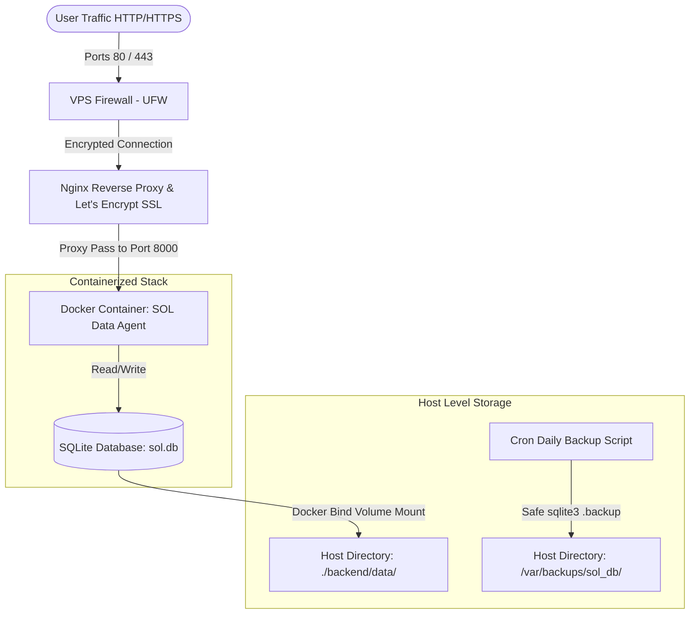

# Production Deployment Guide: SOL Data Agent on Hostinger VPS

This guide provides a bulletproof, secure, and production-ready blueprint for containerizing and deploying the **SOL Data Agent** on an Ubuntu-based Hostinger VPS. 

---

## Architecture Overview



### Key Architectural Decisions
1. **Unified Application Container:** FastAPI serves the API backend, compiles HTML views via `Jinja2Templates`, and mounts static directories inside a single container.
2. **Base Image selection:** We use `python:3.10-slim` instead of `alpine` as a base image. Packages such as `pandas`, `scikit-learn`, `numpy`, and `polars` compile slowly or fail to build on Alpine because of the absence of pre-built wheels for `musl libc`. The slim debian-based image allows fast installation of pre-compiled wheels.
3. **System Binaries Installation:** We install system-level packages (`tesseract-ocr` and `tesseract-ocr-eng`) inside the runner stage of the container so the `pytesseract` OCR engine functions out-of-the-box.
4. **Data Isolation & SQLite Safety:** SQLite is stored inside a host-bound Docker directory. Safe database copies are executed on the host using the SQLite Online Backup API (`.backup`) to avoid file corruption during active database write transactions.

---

## Phase 1: Local Project Containerization

Create the following files in the root of your project directory.

### 1. `.dockerignore`
Prevents local assets, cache files, and credentials from inflating the build context.

```ini
# Git & IDE configs
.git
.gitignore
.vscode
.idea
__pycache__/
*.pyc
*.pyo
*.pyd
.pytest_cache/

# Local databases and logs
*.db
*.sqlite
backend/data/*.db
logs/
*.log

# Python Virtual Environments
venv/
.venv/
env/

# OS-specific files
Thumbs.db
.DS_Store

# Archives
*.zip
*.rar
*.tar.gz
```

### 2. `Dockerfile` (Multi-Stage)
Saves image footprint size by separating compilation dependencies from the final execution environment.

```dockerfile
# ==========================================
# STAGE 1: Builder (Dependency installation)
# ==========================================
FROM python:3.10-slim AS builder

WORKDIR /app

# Install compilation tools needed for potential source builds
RUN apt-get update && apt-get install -y --no-install-recommends \
    build-essential \
    && rm -rf /var/lib/apt/lists/*

# Create virtual environment to isolate dependencies cleanly
RUN python -m venv /opt/venv
ENV PATH="/opt/venv/bin:$PATH"

# Install Python requirements
COPY requirements.txt .
RUN pip install --no-cache-dir --upgrade pip && \
    pip install --no-cache-dir -r requirements.txt

# ==========================================
# STAGE 2: Runner (Minimal production image)
# ==========================================
FROM python:3.10-slim AS runner

WORKDIR /app

# Install system dependencies
# - tesseract-ocr & tesseract-ocr-eng for PyTesseract OCR subsystem
# - libgl1-mesa-glx & libglib2.0-0 for OpenCV / PDF generation rendering libraries
# - sqlite3 for database backup operations and CLI access
RUN apt-get update && apt-get install -y --no-install-recommends \
    tesseract-ocr \
    tesseract-ocr-eng \
    libglib2.0-0 \
    libgl1-mesa-glx \
    sqlite3 \
    && apt-get clean && rm -rf /var/lib/apt/lists/*

# Copy virtual environment from builder stage
COPY --from=builder /opt/venv /opt/venv
ENV PATH="/opt/venv/bin:$PATH"

# Set environment variables for clean logs and execution
ENV PYTHONUNBUFFERED=1
ENV PYTHONDONTWRITEBYTECODE=1

# Copy code structure (only what is required)
COPY backend/ ./backend/
COPY frontend/ ./frontend/
COPY core/ ./core/
COPY utils/ ./utils/
COPY data_layer/ ./data_layer/

# CRITICAL FIX: Ensure directories mounted by FastAPI exist to prevent startup failure
# e.g., FastAPI fails to mount directories if they are missing
RUN mkdir -p "صور التيم" backend/data

EXPOSE 8000

# Start server using Uvicorn CLI to allow binding to 0.0.0.0
# We run 4 workers to handle high-concurrency requests safely
CMD ["uvicorn", "backend.main:app", "--host", "0.0.0.0", "--port", "8000", "--workers", "4"]
```

### 3. `docker-compose.yml`
Defines service containers, persistent volume layouts, and network configurations.

```yaml
version: '3.8'

services:
  web:
    build:
      context: .
      dockerfile: Dockerfile
    container_name: sol_data_agent
    restart: unless-stopped
    ports:
      - "8000:8000"
    volumes:
      # Bind mount for the SQLite database folder to survive container restarts/rebuilds
      - ./backend/data:/app/backend/data
      # Bind mount for the team images folder used by StaticFiles mounting
      - ./صور التيم:/app/صور التيم
    env_file:
      - .env
    networks:
      - sol_network

networks:
  sol_network:
    driver: bridge
```

---

## Phase 2: VPS Provisioning & Hardening (Ubuntu Server)

Perform the following operations directly on your freshly installed Hostinger Ubuntu VPS.

### 1. SSH Connection & Non-Root User Setup
Connect to the server as root, create a dedicated administrator user, and allow passwordless sudo.

```bash
# 1. Connect to VPS (Replace VPS_IP with your Hostinger IP address)
ssh root@VPS_IP

# 2. Create deployer user
adduser deployer

# 3. Add deployer to sudo group
usermod -aG sudo deployer

# 4. Copy authorized keys from root to deployer to maintain SSH access
rsync --archive --chown=deployer:deployer ~/.ssh /home/deployer

# 5. Test deployer user permissions
su - deployer
sudo whoami # Should output: root
exit
```

### 2. SSH Security Hardening
De-authorize password logins and close root ssh access.

```bash
# Edit SSH configuration
sudo nano /etc/ssh/sshd_config
```

Modify or add the following directives in `/etc/ssh/sshd_config`:
```ini
PermitRootLogin no
PasswordAuthentication no
PubkeyAuthentication yes
```
Save (`Ctrl+O`, `Enter`) and exit (`Ctrl+X`), then restart the SSH daemon:
```bash
sudo systemctl restart ssh
```

### 3. Firewall Configuration (UFW)
Secure system ports using Ubuntu's firewall:

```bash
# Define firewall defaults
sudo ufw default deny incoming
sudo ufw default allow outgoing

# Allow standard web and SSH traffic
sudo ufw allow OpenSSH
sudo ufw allow 80/tcp
sudo ufw allow 443/tcp

# Enable Firewall
sudo ufw enable
```

### 4. Software Installation (Docker, Compose, Git, Nginx)
Update package indices and install the production runtime software stack:

```bash
# 1. Update OS package managers
sudo apt update && sudo apt upgrade -y

# 2. Install core utilities
sudo apt install -y curl git nginx apt-transport-https ca-certificates gnupg lsb-release

# 3. Add Docker’s official GPG key and repository
sudo mkdir -p /etc/apt/keyrings
curl -fsSL https://download.docker.com/linux/ubuntu/gpg | sudo gpg --dearmor -o /etc/apt/keyrings/docker.gpg

echo \
  "deb [arch=$(dpkg --print-architecture) signed-by=/etc/apt/keyrings/docker.gpg] https://download.docker.com/linux/ubuntu \
  $(lsb_release -cs) stable" | sudo tee /etc/apt/sources.list.d/docker.list > /dev/null

# 4. Install Docker Engine & Plugins
sudo apt update
sudo apt install -y docker-ce docker-ce-cli containerd.io docker-compose-plugin

# 5. Start and enable Docker daemon
sudo systemctl enable --now docker

# 6. Allow deployer user to run Docker without sudo
sudo usermod -aG docker deployer
newgrp docker # Refreshes active shell group memberships
```

---

## Phase 3: Code Deployment & Environment Sync

Run these commands as the `deployer` user on the VPS.

### 1. Setup Private Git Clone (Deploy Keys)
If your repository is hosted privately on GitHub/GitLab, configure a read-only Deploy Key:

```bash
# Generate a new SSH keypair
ssh-keygen -t ed25519 -C "vps-deploy-key" -f ~/.ssh/id_ed25519_deploy

# Display the public key to register in Git hosting provider
cat ~/.ssh/id_ed25519_deploy.pub
```
* **Step:** Copy the public key text output. Go to your Git Repository -> **Settings** -> **Deploy Keys** -> **Add Deploy Key**, paste the key, and do NOT check "Allow write access".

Configure SSH on the VPS to use this deploy key for clone processes:
```bash
nano ~/.ssh/config
```
Add the following blocks:
```ini
Host github.com
  IdentityFile ~/.ssh/id_ed25519_deploy
  IdentitiesOnly yes
```
Set correct permissions and clone the project:
```bash
chmod 600 ~/.ssh/config ~/.ssh/id_ed25519_deploy
ssh -T git@github.com # Confirm connection

# Clone your project to a deployment directory
sudo mkdir -p /var/www/sol-app
sudo chown -R deployer:deployer /var/www/sol-app
git clone git@github.com:yourusername/your-repo.git /var/www/sol-app
```

### 2. Environment Secrets Management
Create and secure your production `.env` configuration file:

```bash
cd /var/www/sol-app
touch .env
chmod 600 .env # Restricts reading permissions to owner only
nano .env
```

Paste your variables (ensure database URL points to the internal container directory, and you replace placeholders with secret values):
```ini
# Core Configuration
SECRET_KEY=b91a603957beab8d956f2f9f98f6d89bdfad741df747372cf91c0e358b68832a
ALGORITHM=HS256
ACCESS_TOKEN_EXPIRE_MINUTES=30

# Production Database (Internal container path mapped to the Docker volume)
DATABASE_URL=sqlite:///./backend/data/sol.db

# SMTP Configuration
SMTP_HOST=smtp.gmail.com
SMTP_PORT=465
SMTP_USER=solixagentic@gmail.com
SMTP_PASSWORD=your_secure_smtp_app_password

# External Service Keys
GROQ_API_KEY=your_actual_groq_key
GROQ_API_KEYS=key1,key2
ELEVENLABS_API_KEY=your_elevenlabs_key
ELEVENLABS_VOICE_ID=JBFqnCBsd6RMkjVDRZzb
OPENROUTER_API_KEY=your_openrouter_key
HF_TOKEN=your_hugging_face_token
KAGGLE_USERNAME=mohamedshalaby11
KAGGLE_KEY=your_kaggle_key
KAGGLE_API_TOKEN=your_kaggle_key
```

### 3. Spin Up Application
Build and execute the services in detached mode:

```bash
# Create directory bind-mount dependencies on the host
mkdir -p /var/www/sol-app/backend/data
mkdir -p "/var/www/sol-app/صور التيم"

# Set permissions
chmod -R 775 /var/www/sol-app/backend/data
chmod -R 775 "/var/www/sol-app/صور التيم"

# Run Compose
docker compose up -d --build

# Verify container status and logs
docker compose ps
docker compose logs -f
```

---

## Phase 4: Reverse Proxy (Nginx) & SSL Automation

We will route traffic from ports 80/443 directly to port 8000 of our container, using Nginx to handle SSL termination.

### 1. Configure Nginx Server Block
Create a virtual host configuration file:

```bash
sudo nano /etc/nginx/sites-available/yourdomain.com
```

Paste the following configurations (replacing `yourdomain.com` with your actual domain):

```nginx
server {
    listen 80;
    listen [::]:80;
    server_name yourdomain.com www.yourdomain.com;

    # Adjust file size limit for dataset uploads
    client_max_body_size 100M;

    # Nginx Logs
    access_log /var/log/nginx/sol_access.log;
    error_log /var/log/nginx/sol_error.log;

    # Proxy to FastAPI Gunicorn/Uvicorn Container
    location / {
        proxy_pass http://127.0.0.1:8000;
        proxy_http_version 1.1;
        
        # Connection upgrades for websockets support (Real-time Task Progress)
        proxy_set_header Upgrade $http_upgrade;
        proxy_set_header Connection "upgrade";
        
        # Standard Headers
        proxy_set_header Host $host;
        proxy_set_header X-Real-IP $remote_addr;
        proxy_set_header X-Forwarded-For $proxy_add_x_forwarded_for;
        proxy_set_header X-Forwarded-Proto $scheme;
        
        # Buffer tuneups for streaming output (AI Voice narration / LLM streaming)
        proxy_read_timeout 300s;
        proxy_connect_timeout 75s;
        proxy_buffering off;
    }
}
```

Enable the configuration and reload Nginx:
```bash
# Create symbolic link to enable website configuration
sudo ln -s /etc/nginx/sites-available/yourdomain.com /etc/nginx/sites-enabled/

# Remove default nginx site config to prevent conflict override
sudo rm -f /etc/nginx/sites-enabled/default

# Verify syntax configuration is correct
sudo nginx -t

# Restart service
sudo systemctl restart nginx
```

### 2. SSL Installation and Automatic Renewal Setup
Using Certbot and Let's Encrypt certificates:

```bash
# 1. Install Certbot
sudo apt install -y certbot python3-certbot-nginx

# 2. Request certificate (Certbot configures Nginx block automatically)
sudo certbot --nginx -d yourdomain.com -d www.yourdomain.com
```
* **Step:** Answer security questions. Choose options to automatically redirect HTTP traffic to HTTPS (Option `2` if prompted, or Certbot will configure redirects automatically).

Verify automated cron verification is active:
```bash
# Run renewal dry run to test auto-timer
sudo certbot renew --dry-run
```
Let’s Encrypt installation configures a systemd-timer `/lib/systemd/system/certbot.timer` running automatically twice a day to renew certificates expiring within 30 days.

---

## Phase 5: Production Maintenance & Backups

To prevent SQLite database corruption during backups, **do not copy the `.db` file directly** when transactions are running. Instead, we use the SQLite online backup utility to safely copy the database page-by-page.

### 1. Safe Backup Shell Script
Create a backup script on the Host VPS:

```bash
sudo mkdir -p /var/backups/sol_db
sudo touch /usr/local/bin/backup_sqlite.sh
sudo chmod +x /usr/local/bin/backup_sqlite.sh
sudo nano /usr/local/bin/backup_sqlite.sh
```

Paste the following script:

```bash
#!/bin/bash

# Configuration
DB_PATH="/var/www/sol-app/backend/data/sol.db"
BACKUP_DIR="/var/backups/sol_db"
TIMESTAMP=$(date +"%Y%m%d_%H%M%S")
BACKUP_FILE="${BACKUP_DIR}/sol_backup_${TIMESTAMP}.sqlite"
LOG_FILE="/var/log/sol_backup.log"

# Ensure backup directory exists
mkdir -p "$BACKUP_DIR"

echo "=== Backup started at $(date) ===" >> "$LOG_FILE"

# 1. Verify source SQLite database exists
if [ ! -f "$DB_PATH" ]; then
    echo "ERROR: SQLite database file not found at ${DB_PATH}" >> "$LOG_FILE"
    exit 1
fi

# 2. Run Safe online backup using local sqlite3 binary
# This locks transactions gracefully, creating a clean snapshot
sqlite3 "$DB_PATH" ".backup '${BACKUP_FILE}'" >> "$LOG_FILE" 2>&1

if [ $? -eq 0 ]; then
    # 3. Compress the backup to save disk space
    gzip "$BACKUP_FILE"
    echo "SUCCESS: Database backup completed successfully: ${BACKUP_FILE}.gz" >> "$LOG_FILE"
else
    echo "ERROR: sqlite3 backup process failed." >> "$LOG_FILE"
    exit 1
fi

# 4. Clean up backups older than 14 days to prevent storage leak
find "$BACKUP_DIR" -name "sol_backup_*.sqlite.gz" -type f -mtime +14 -delete
echo "SUCCESS: Rotated and removed old backups." >> "$LOG_FILE"

echo "=== Backup completed at $(date) ===" >> "$LOG_FILE"
```

Create the log file and set correct permissions:
```bash
sudo touch /var/log/sol_backup.log
sudo chmod 644 /var/log/sol_backup.log
```

Test the backup script manually:
```bash
sudo /usr/local/bin/backup_sqlite.sh
cat /var/log/sol_backup.log
ls -lh /var/backups/sol_db/
```

### 2. Configure Cron Job
Automate the execution of backups to run daily at 2:00 AM:

```bash
# Open crontab setup
sudo crontab -e
```

Add the following line at the end of the file:
```cron
0 2 * * * /usr/local/bin/backup_sqlite.sh > /dev/null 2>&1
```

---

## 🛠️ Verification & Troubleshooting Checklist

Once deployed, use this command checklist for validation:

| Action / Verification | Target Command |
| :--- | :--- |
| **Check Container status** | `docker compose ps` |
| **View Live Container Logs** | `docker compose logs -f --tail=100` |
| **Restart App Stack** | `docker compose restart` |
| **Check Port 8000 Listen** | `sudo ss -tulpn \| grep 8000` |
| **Test Nginx Routing** | `curl -I http://localhost:8000/` |
| **Verify SQLite integrity** | `sqlite3 /var/www/sol-app/backend/data/sol.db "PRAGMA integrity_check;"` |
| **Test SSL configuration** | Check via SSL Labs: `https://www.ssllabs.com/ssltest/` |
