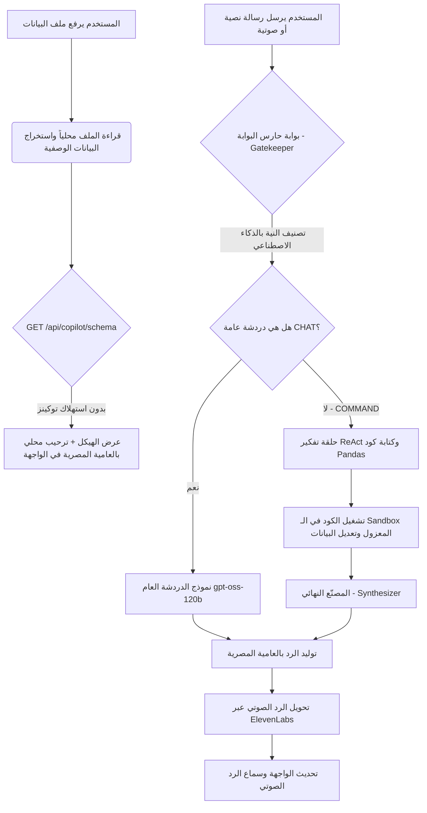

# 🔄 سير العمل البرمجي (WORKFLOW.md)

يشرح هذا المستند بالتفصيل مسار البيانات وكيفية عمل نظام **SOL Data Agent** ومساعد البيانات الصوتي بالتفصيل من البداية وحتى إنتاج المخرجات.

---

## 🗺️ المخطط العام لسير العمل (Architecture Diagram)

---

## 🛠️ تفاصيل مراحل معالجة البيانات

### 1️⃣ مرحلة رفع الملف وتجنب التوكينز (Zero-Token Upload Stage)
لتجنب استنزاف التوكينز بمجرد رفع الملف وقبل أن يتحدث المستخدم:
* **رفع الملف**: يتم رفع الملف وحفظه مؤقتاً في خادم FastAPI داخل الذاكرة (`_store`).
* **استخراج الهيكل**: يتصل الفرونت إند بـ `/api/copilot/schema/{dataset_id}` ويحصل على أسماء الأعمدة، والأنواع، وعدد الصفوف، والسطور عشوائية المعاينة. تتم هذه العملية **محلياً بالكامل** باستخدام Pandas دون إرسال توكينز للذكاء الاصطناعي.
* **الترحيب المحلي**: يتم طباعة ترحيب محلي مثل:
  > *"يا هلا بيك يا بشمهندس! رفعت ملف فيه {rows} صف و {cols} عمود. تحب نعمل إيه بالبيانات دي؟"*

---

### 2️⃣ معالجة المدخلات وحارس البوابة (Gatekeeper & Intent Classification)
عندما يكتب أو يتحدث المستخدم:
* **حارس البوابة (`refine_user_input`)**: يتم إرسال النص لـ Cerebras API مستخدماً نموذج `gpt-oss-120b` مع تفعيل خيار تنسيق الـ JSON الإجباري لضمان دقة الرد.
* **تصنيف النية**:
  * `CHAT`: للتحيات، مثل *"أهلاً وسهلاً"*، *"عامل إيه يا سول؟"*، أو *"مين اللي عملك؟"*.
  * `COMMAND`: لأي طلبات تنظيف أو تحليل للبيانات، مثل *"امسح القيم الفاضية"*، *"اعملي رسم بياني للمرتبات"*.

---

### 3️⃣ تشغيل حلقة التفكير والتعديل (ReAct & Sandbox Execution)
إذا كانت النية `COMMAND`:
1. **توليد الكود**: يقوم مساعد البيانات بكتابة كود Python مستنداً إلى الهيكل المرسل (Schema) والهدف العام لتنظيف البيانات.
2. **البيئة المعزولة (Sandbox)**: يتم تنفيذ الكود بداخل بيئة آمنة محلياً لتقييم الكود وتحديث الـ DataFrame مباشرة في الذاكرة.
3. **تكرار وحماية الطلبات**:
   - تتم المحاولة بحد أقصى `3` مرات برمجياً.
   - يتم إدخال توقف مؤقت لثانيتين `await asyncio.sleep(2)` بين كل طلب وآخر لتفادي حظر الـ API أو الحصول على خطأ 429 (Rate Limit).

---

### 4️⃣ الصياغة النهائية والتحويل الصوتي (Synthesis & ElevenLabs TTS)
* **المصنّع النهائي (Synthesizer)**: يستقبل مخرجات تشغيل الكود من الـ Sandbox (مثل: *"تم حذف 5 صفوف فارغة بنجاح"*)، ويقوم بصياغة جملة بالعامية المصرية البسيطة التي يفهمها مهندسو البيانات، بشرط ألا تتخطى 25 كلمة لكي تكون سريعة وسهلة الاستماع.
* **ElevenLabs TTS**: يتم إرسال الجملة المصاغة لـ ElevenLabs وتوليد ملف صوتي وبثه مباشرة للمستخدم ليظهر الرد الصوتي بشكل تفاعلي.
