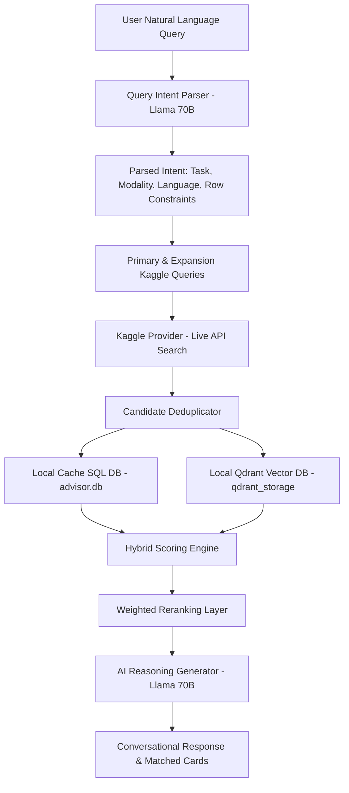

# Chapter 3: Technical and Functional Feature Catalog

---

## Section 1: Universal Data Loader
The **Universal Data Loader** is the primary gateway for dataset ingestion into the SOLIX platform. It provides high-performance, memory-safe, and asynchronous file uploading, structure profiling, and parquet standardization.

### 1.1 Supported Data Formats
The data loader supports ingestion of the following formats:
*   **Comma-Separated Values (`.csv`)**: Traditional tabular files, including standard delimiters (commas, tabs, semicolons) and custom text qualifiers.
*   **Excel Spreadsheets (`.xlsx`, `.xls`)**: Standard Microsoft Excel spreadsheets, automatically loaded sheet-by-sheet.
*   **JSON Documents (`.json`)**: Text-based hierarchical data, flattened dynamically into tabular form.
*   **Apache Parquet (`.parquet`)**: High-performance columnar storage files.

### 1.2 Ingestion Pipeline & Factory Registry
Upon receiving a file through the `/api/upload` endpoint, the Universal Data Loader executes the following steps:
1.  **Unique Identifier Generation**: A unique UUID version 4 is generated as the `dataset_id`.
2.  **Memory-Safe Chunked Upload**: The raw file stream is written to the local disk at `temp_snapshots/{dataset_id}_raw{ext}` in binary chunks of `1MB` (1,048,576 bytes). This prevents high RAM consumption and avoids FastAPI memory exhaustion during large uploads.
3.  **Lazy Profile Ingestion**: The system invokes the `MetadataAnalyzer` to extract structural summaries (row count, column count, null percentage, data types) from the raw file path.
4.  **Parquet Standardization Layer**: To optimize memory layouts and guarantee standard schemas, all incoming formats are compiled to Parquet columnar format using the following rules:
    *   **Parquet**: Transferred directly via file copy utilities.
    *   **CSV**: Handled via out-of-core streaming parsing. It utilizes Polars lazy frames (`pl.scan_csv(temp_raw_path, infer_schema_length=10000).sink_parquet(parquet_path)`) to compile directly to parquet without loading the raw CSV into RAM. If this fails due to complex schemas, it falls back to standard pandas read/write.
    *   **Excel & JSON**: Parsed via pandas (`pd.read_excel` or `pd.read_json`) and written to the workspace parquet cache at `temp_snapshots/{dataset_id}.parquet`.
5.  **Temporary Cleanup**: The temporary raw upload file is removed from disk immediately.

### 1.3 Memory Optimization & Preview Cache
To prevent Out-Of-Memory (OOM) errors on the host server:
*   **Small Datasets ($\le$ 50,000 rows)**: Loaded fully into memory as a Pandas DataFrame in `_store` to guarantee complete compatibility with pandas-based analytical APIs.
*   **Large Datasets ($>$ 50,000 rows)**: Only a 500-row preview is loaded into the active Pandas memory store. The full dataset remains stored on disk as a Parquet file, and all deep cleaning or processing operations are delegated to remote background workers or out-of-core streaming.

### 1.4 Active Caching and Registry Map
The data loader registers the session details in the following global structures:
*   `_store`: Maps `dataset_id` to the active Pandas DataFrame.
*   `_store_parquet_path`: Tracks the absolute path of the standardized parquet file.
*   `_store_filename`: Holds the original user-supplied file name.
*   `_store_ext`: Holds the original file extension.

---

## Section 2: AI Dataset Advisor
The **AI Dataset Advisor** is an intelligent retrieval and search engine designed to recommend datasets based on natural language queries. It leverages vector representations, SQL metadata, and LLM reasoning to match user goals with optimal data sources.

### 2.1 Technical Architecture
The advisor combines SQL database indexing with semantic vector searches to build a hybrid retrieval system.

### 2.2 Semantic Intent Parser
When a query is received, the `query_parser` uses `llama-3.3-70b-versatile` via Groq to extract search criteria, producing a `ParsedQueryIntent` Pydantic schema:
*   `detected_language`: Detects the search language (Arabic vs English).
*   `task_type`: Identifies the target machine learning task (e.g., classification, regression, NLP, computer vision).
*   `modality`: Identifies the format (tabular, text, vision, audio).
*   `min_rows` & `max_rows`: Numeric constraints on dataset size.
*   `primary_kaggle_query`: The main optimized query string for the Kaggle Search API.
*   `expansion_queries`: Alternative search terms to maximize recall.

### 2.3 Local & Remote Vector Indexing
*   **Vector Database**: Built on **Qdrant**, utilizing local disk storage at `./backend/data/qdrant_storage`.
*   **Embedding Generator**: Utilizes the local **SentenceTransformer** model (`sentence-transformers/paraphrase-multilingual-MiniLM-L12-v2`) inside a Singleton class `EmbeddingService` to generate dense 384-dimensional vectors. This model is multilingual, allowing queries in Arabic, English, or mixed Arabized slang.
*   **Upsert Scheme**: Every discovered dataset is formatted into a structural string (including title, task type, language, tags, and description) and indexed inside the Qdrant collection named `datasets`.

### 2.4 Hybrid Scoring and Reranking Layer
The retrieved candidate datasets are scored using a weighted hybrid formula:
$$\text{Score} = 0.40 \cdot S_{\text{semantic}} + 0.20 \cdot S_{\text{task}} + 0.15 \cdot S_{\text{modality}} + 0.15 \cdot S_{\text{language}} + 0.10 \cdot S_{\text{size}}$$

*   **Semantic Score ($S_{\text{semantic}}$)**: Cosine similarity between the search query vector and the dataset document vector.
*   **Task Match ($S_{\text{task}}$)**: Hard matching (1.0) or soft matching (0.7) between parsed query task and dataset metadata.
*   **Modality Match ($S_{\text{modality}}$)**: Fits tabular, NLP, or vision tags to the query modality.
*   **Language Match ($S_{\text{language}}$)**: Matches target languages; Arabic search queries prioritize datasets with Arabic descriptions or UTF-8 non-ASCII characters.
*   **Size Match ($S_{\text{size}}$)**: Continuous progressive penalty if the dataset row count violates the user's requested dimensions:
    *   $\text{Ratio} \le 1.5$: Score is 0.8
    *   $\text{Ratio} \le 3.0$: Score is 0.5
    *   $\text{Ratio} \le 10.0$: Score is 0.2
    *   $\text{Ratio} > 10.0$: Score is 0.05

---

## Section 3: Synthetic Data Studio
The **Synthetic Data Studio** is a platform for generating high-fidelity, privacy-preserving mock datasets. It supports simple statistical mocks and complex, machine-learning-based synthesis on Kaggle Cloud.

### 3.1 Kaggle Cloud Orchestrator
For deep learning synthesis (using CTGAN or TVAE models), the local backend coordinates with the Kaggle API.

1.  **Task Registration**: A unique `task_id` is registered in `_store_tasks` with progress tracked.
2.  **Asset Bundling**: The orchestrator packages the raw source Parquet file, a zip file containing the custom generation code (`studio_core.zip`), and a config payload containing hyperparameter setups (epochs, row count target, null percentages).
3.  **Kaggle Dataset Mount**: Pushes this package as a private dataset named `solsynthin{task_uuid}`.
4.  **Kaggle Kernel Push**: Packages the execution kernel containing `kaggle_synthetic_kernel.py` and pushes it as a private Kaggle notebook script `solsynthker{task_uuid}`.
    *   **GPU Acceleration**: The kernel metadata specifies `enable_gpu = True` to enable PyTorch GPU acceleration for training tabular generative models.
    *   **Internet Access**: Configured with internet access to download required libraries (like SDV/Synthetic Data Vault).
5.  **Asynchronous Polling**: A background thread polls the Kaggle API (`api.kernels_status`) every 5 seconds.
6.  **Download and Clean**: Once the execution finishes, the thread downloads the output folder (`synthetic.parquet`, `report.json` containing fidelity scores, `privacy_report.json` detailing membership leakage risk, and `data_dict.md` documenting columns). It then requests a deletion command to clean up the temporary dataset from Kaggle.

### 3.2 Mock Generator and Fallback Synthesis
If Kaggle credentials are not provided or if the user selects the statistical generator:
*   **Statistical Generator**: Analyzes column datatypes, computes mean, standard deviation, categories distribution, and correlation matrices.
*   **Faker Integration**: Synthesizes custom columns like names, emails, phones, and addresses.
*   **Referential Integrity**: Maintains primary-foreign key relationships and date logic (e.g., `join_date` is always before `termination_date`).

---

## Section 4: Chaos Corruptor Engine
The **Chaos Corruptor Engine** is a testing utility designed to benchmark the resiliency of data cleaning pipelines by injecting controlled anomalies, noise, and structural issues into clean datasets.

### 4.1 Injection Anomaly Types
The class `DataCorruptor` manages the injection process. The types of injected anomalies include:
*   **Missing Values (NaN)**: Randomly sets values in target columns to `np.nan` based on the specified ratio.
*   **Outliers (Numeric)**: Multiplies or divides numeric values by a random float factor between 5.0 and 500.0, injecting extreme anomalies.
*   **Typos (Text)**: Modifies text columns using three mutation operations:
    *   `swap`: Swaps adjacent characters (e.g., "John" $\rightarrow$ "Jonh").
    *   `drop`: Drops a random character (e.g., "John" $\rightarrow$ "Jon").
    *   `add`: Adds a random letter at a random index.
*   **Formatting Issues**: Injects white spaces (leading, trailing, or double middle spaces) in text columns.
*   **Type Inconsistency**: Introduces text flags like "Unknown", "N/A", "Error", "???", or "Invalid" into numeric or date columns.
*   **Duplications**: Appends a selected fraction of rows as duplicates, shuffle-mixing them back into the active DataFrame.

---

## Section 5: OCR Data Extraction Engine
The **OCR Data Extraction Engine** allows users to ingest documents (PDFs, scans, images) and extract tabular structured data.

### 5.1 Architecture & Native Dependencies
*   **Core Engine**: PyTesseract (Tesseract OCR wrapper).
*   **Document Reader**: PyMuPDF (`fitz`).
*   **Zero-Poppler Dependency**: By utilizing PyMuPDF to extract layout objects directly, the engine does not require Poppler or external Linux binaries.
*   **Short Path Resolution**: On Windows systems, Arabic and space-containing installation folders can break command executions. The processor wraps Tesseract binaries with Windows Short Path utility API:
    `ctypes.windll.kernel32.GetShortPathNameW`

### 5.2 PDF Processing Pipeline
For PDF inputs, the system runs a multi-step extraction:
1.  **Resolution Boost**: Convert PDF pages into high-resolution images (`matrix = fitz.Matrix(2, 2)`) to double the density and improve text recognition.
2.  **Multilingual Engine Call**: Runs PyTesseract's engine with `lang='eng+ara'` to read both Arabic and English text from the image buffer.
3.  **PDF Layout Insertion**: Generates search-ready PDF bytes using `pytesseract.image_to_pdf_or_hocr` and writes the searchable page directly into the final PDF.

### 5.3 Tabular Structure Parsing (`text_to_dataframe`)
To convert OCR text outputs into structured pandas DataFrames, the parsing engine:
*   **Delimiter Detection**: Analyzes the first lines to find the delimiter (tabs `\t`, pipes `|`, commas `,`, or spaces ` `).
*   **Column Alignment**: Splits lines by the detected separator.
*   **Row Size Balancer**: Matches rows to the header row dimension, dynamically appending empty fields or slicing excess values to prevent structural parse errors.
