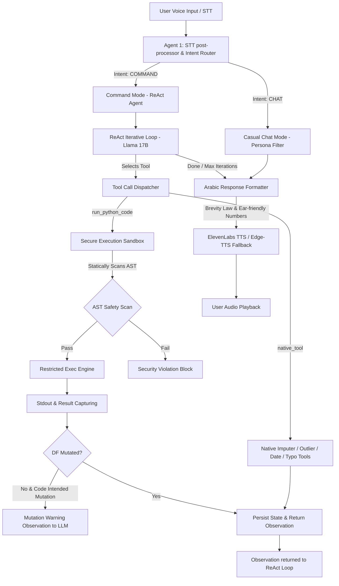

# Chapter 4: SOL Voice Copilot Engine

---

## Section 1: Voice Copilot Architecture
The **SOL Voice Copilot Engine** is a conversational AI agent designed for interactive, voice-first dataset cleaning, exploration, and training. It supports natural speech queries, executes actions in a secure code sandbox, and responds with natural Egyptian Arabic voice synthesis.

---

## Section 2: Agent 1 - STT Post-Processor & Intent Router
User input is processed by a specialized natural language gateway before reaching the core execution agent.

### 2.1 Intent Classification
Using `meta-llama/llama-4-scout-17b-16e-instruct` via Groq, the input is classified into one of two intents:
*   **`CHAT`**: Restricted to social greetings (e.g., "أهلاً", "صباح الخير", "عامل إيه") or basic identity questions.
*   **`COMMAND`**: The default for all other prompts, including data queries, requests to explain data, cleaning commands, or modeling requests.

### 2.2 Arabized Data Slang Mapping
Voice transcripts of developers speaking Arabic often contain phonetic, English-based programming terms. The post-processor maps these Arabized terms internally to their clean Python/Pandas equivalents without correcting or lecturing the user:
*   `داتا فريم` $\rightarrow$ `DataFrame`
*   `ميزنج فاليو` / `ميسنج` $\rightarrow$ `missing values`
*   `دروب` $\rightarrow$ `drop`
*   `فيلنا` $\rightarrow$ `fillna`
*   `جروب باي` $\rightarrow$ `groupby`
*   `كولوم` $\rightarrow$ `column`
*   `لوب` $\rightarrow$ `loop`
*   `مين` $\rightarrow$ `mean`
*   `ميديان` $\rightarrow$ `median`
*   `بلوت` $\rightarrow$ `plot`

---

## Section 3: ReAct Thinking & Tool Execution Loop
For `COMMAND` intents, the agent operates in an iterative **Reason-Action-Observation (ReAct)** loop.

### 3.1 ReAct Loop Details
1.  **System Prompt Customization**: The agent receives a system prompt containing the dataset's current Polars schema, columns list, null mapping, and active configurations.
2.  **Tool Availability**: The agent has access to 5 major tools:
    *   `run_python_code`: For data exploration, plotting, and summarizing.
    *   `smart_impute_column_tool`: Imputes missing values on a target column using the AI Imputer.
    *   `clean_column_outliers_tool`: Detects and cleans numeric outliers in a column.
    *   `standardize_column_date_tool`: Standardizes date formats.
    *   `fuzzy_fix_column_tool`: Performs fuzzy string merging on text columns.
3.  **Iteration Limit**: The ReAct loop is capped at a hard maximum of `MAX_ITERATIONS = 3` turns per request to prevent infinite loops, API token exhaustions, and high response latencies.
4.  **Mutation Verification**: If the LLM generates Python code with the intent to mutate the dataset (e.g., using keywords like `dropna`, `drop`, `fillna`, `replace`) but fails to reassign the DataFrame (e.g. forgot `df = df.dropna()` or `inplace=True`), the system detects this via hash validation and returns a warning:
    `"System Observation: The DataFrame did NOT change after this operation. Fix the code and call run_python_code again."`

---

## Section 4: Secure Code Execution Sandbox
To run LLM-generated code safely, the platform implements a secure, isolated sandbox inside `core/copilot/sandbox.py`.

### 4.1 AST Safety Verification (`_SecurityVisitor`)
Prior to execution, the code string is parsed into an Abstract Syntax Tree (AST). A custom visitor walks the tree and blocks forbidden commands:
*   **Import Restrictions**: Checks `visit_Import` and `visit_ImportFrom`. Imports are strictly limited to a whitelist of libraries: `pandas`, `numpy`, `math`, `statistics`, `re`, `json`, `datetime`, `collections`, `sklearn`, `scipy`.
*   **Namespace Blocklist**: Rejects access to sensitive standard functions and modules: `os`, `sys`, `subprocess`, `shutil`, `pathlib`, `open`, `eval`, `exec`, `globals`, `locals`, `socket`, `requests`, `urllib`.
*   **Pandas Cleaning Restrictions**: To force the agent to use the dedicated native tools rather than raw pandas code, the AST blocks raw cleaning attributes: `fillna`, `dropna`, `interpolate`, `bfill`, `ffill`, `KNNImputer`, `IterativeImputer`.

### 4.2 Namespace Isolation
The sandbox isolates execution within a restricted local namespace.
*   `__builtins__` is overridden with a pre-screened list of safe functions (`_SAFE_BUILTINS`), blocking access to unsafe functions like file creation, network connections, and system command executions.
*   The active DataFrame is injected into the namespace as a copy (`df.copy()`). If the execution succeeds, the system updates the state; if it fails, the active state remains unchanged.

### 4.3 Output and Exception Capturing
*   **Stdout Capturing**: Uses Python's `contextlib.redirect_stdout` to capture print statements and console logs.
*   **Result Normalization**: If the code does not assign a value to the local `result` variable but outputs to stdout, the sandbox returns the stdout text as the execution result. Tabular data structures (DataFrames and Series) are automatically formatted to strings using `to_string(max_rows=20)`.

---

## Section 5: Response Formatter & Egyptian Arabic Voice Synthesis
Once the ReAct loop resolves, the result is translated into a natural spoken reply.

### 5.1 Persona and Voice Laws
*   **Persona**: SOL is an Egyptian male data engineer. He speaks strictly in natural Egyptian Arabic (`العامية المصرية`) using warm, collegial phrasing.
*   **Voice Brevity Law**: Spoken responses are limited to a maximum of **25 Arabic words** (designed to fit in one breath). Thinking out loud, markdown elements, backticks, asterisks, and code snippets are stripped from the spoken output.
*   **Dynamic Gender Adaptation**: SOL assumes a default male user. If the system detects feminine Arabic self-references (e.g. "أنا عايزة", "جاهزة", "مش عارفة"), it adapts the pronouns and addresses the user as `بشمهندسة` (female engineer).
*   **Ear-Friendly Numbers**: Large numbers are rounded and converted to conversational scales:
    *   `4,982` $\rightarrow$ `"حوالي 5 آلاف"`
    *   `156,800` $\rightarrow$ `"حوالي 157 ألف"`
    *   `0.873` $\rightarrow$ `"حوالي 87%"`

### 5.2 ElevenLabs & Fallback Audio Pipeline
Spoken responses are sent to the Text-To-Speech (TTS) pipeline in `core/copilot/tts_client.py`:
1.  **ElevenLabs (Primary)**: Uses the `eleven_multilingual_v2` model with a custom Egyptian voice ID.
2.  **Edge TTS (Secondary Fallback)**: If the ElevenLabs API is unavailable or the key is not set, the system falls back to Microsoft Edge TTS using the natural Egyptian voice `ar-EG-SalmaNeural`.
3.  **gTTS (Tertiary Fallback)**: If both fail, it uses Google Text-To-Speech (`gTTS`) to guarantee audio playback.
